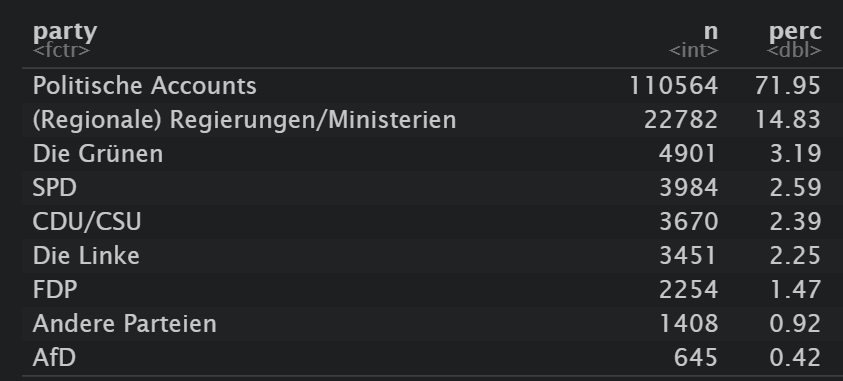

layout: true
    
<div class="logo"></div> 


```{r setup, include=FALSE}
# Here you can place global options for the entire document.
# Mostly used for knitr settings, but can also load data etc.
# Whatever happens here will not show in the presentation.
knitr::opts_chunk$set(fig.retina = 3, 
                      warning = FALSE, 
                      message = FALSE,
                      echo = F)


library(tidyverse)

source("../../../phd/codebase/algo_ads/helpers.R")

overview <- readRDS("../../../phd/codebase/algo_ads/data/overview.rds")

overview_day <- readRDS("../../../phd/codebase/algo_ads/data/overview_day.rds")

# dir("../img", recursive = T, full.names = T) %>%
#   walk(~{file.copy(.x, str_remove(.x, "\\.\\.\\/"))})

```


---

class: white, middle, white

.pull-left[


]

.pull-right[


]


---

# Roadmap


1. Introduction to Political Microtargeting

2. Platform-centric methods

  + Toxic Microtargeting
  
      + I. APIs
    
      + II. Scraping
    
3. User-centric methods

  + Collaboration with Who Targets Me

      + III. Tracking users (with browser apps) 
    
  + Algorithm Audit Study with Dutch political parties
  
      + IV. Data donation approach
    
4. Q & A

---

class: center, middle, white

# Slides: favstats.github.io/nefca2023


---

class: center, middle, white

.pull-left[

<br>
<br>
<br>
<br>

### Who do you think this ad is targeted at?

]

.pull-right[


]


---

class: center, middle, white

.pull-left[

<br>
<br>
<br>
<br>

### Who do you think this ad is targeted at?


#### Men, 36-65+ year old, Noord-Holland, Zuid-Holland, Noord Brabant, and Gelderland, 11,191 people


*maybe: **excluded** people interested in veganism, green building*, ***included*** *college educated people interested in politics*


]

.pull-right[


]


---

class: center, middle, white

.pull-left[

<br>
<br>
<br>
<br>

### Who do you think this ad is targeted at?

]

.pull-right[


]


---

class: center, middle, white

.pull-left[

<br>
<br>
<br>
<br>

### Who do you think this ad is targeted at?

#### Women, 18-34 year old, Noord-Holland, Zuid-Holland, Noord Brabant, 1,975 people


]

.pull-right[


]


---

## What is political microtargeting?

> a set of techniques to leverage ***individual-level data*** for the delivery of political messages to specific target groups that are expected to be more ***susceptible*** to them


What does more "susceptible" mean?

Expectation that it is more *effective*

--

Based on congruency between recipient and message:

+ **congruency** theory (Aaker 1999)

+ the main idea is:

  + people pay more attention when messages align with self-concept of receiver
  
  + when paying more attention they may have greater impact (Petty and Cacioppo 1986; Wheeler, DeMarree, and Petty 2008)
  

---

## (Some) Types of Microtargeting

+ *behavioral targeting* (Dobber et al. 2019)
  
  + e.g. people that engage with political content online
  
--
  
+ *psychographic* or *psychological targeting* (Tufekci 2014, Sharp 2018)

  + matching a person's personality (like their degree of extraversion) to the content of an ad can increase an ad's persuasive power and increase the clicks and conversions it generates (Moon 2002, Wheeler 2008)
  
  +  Nai and Maier (2020) show that uncivil attack ads are most effective in lowering perceptions of the attacked politician when the receiver of the message scores high on psychopathy
  
--

+ *issue-based targeting* (Endres 2020)

  + people who care about climate change, economy, abortion rights
  


---


### Effectiveness


+ In (field) experiments, tentative evidence suggests that microtargeted political ads are indeed effective (Dobber et al., 2020; Dobber
et al., 2023; Endres, 2020; Krotzek, 2019; Tappin et al., 2023; Zarouali et al., 2022).


+ messages about abortion rights were most **effective in increasing vote share of women in competitive congressional districts** (Haenschen, 2022)

+ Krotzek (2019) and Zarouali et al. (2022) find that political ads tailored to match personality traits **enhance positive feelings towards candidates and increase persuasiveness**

--

.pull-left[


]

--

.pull-right[

however: see also Coppock et al., 2020; Decker and Krämer, 2023 for more mixed findings

]

---

class: white

### Offline vs. Online Political Microtargeting

.pull-left[

#### Offline


]


.pull-right[


#### Online


]

---

class: white

### Online Political Microtargeting

.pull-left[


]

.pull-right[
**1. Scalability**

- Offline campaigning: limited volunteers & time

- Digital campaigns reach vast audiences quickly

<br>

**2. Accessibility**

- Microtargeting techniques available even for budget-limited campaigns

- Use of platform-provided data and own contact lists

]


---

### Not all platforms are the same for political microtargeting

.pull-left[
**Meta**  allows targeting based on:
  + detailed demographics (age, gender, education, etc.)
  + users "interests" 
  + behavioral targeting 
  + custom and lookalike audiences
  
(***Focus of this presentation***)

**Google** only allows limited targeting 
  + age, gender, location 
  + keywords for political ads
  
**Twitter** disallowed political ads in 2019
  + were brought them back recently (2023)
  + detailed targeting possible (demographics, custom and lookalike audiences)

]

--

.pull-right[
**Snapchat** offers detailed targeting 
  + demographics, custom and lookalike audiences
  + however is relatively understudied (e.g. Tanusondjaja 2023)
  

**TikTok** disallows political ads 
  + but researchers have documented its use: https://tiktok-audit.com/blog/2023/tiktok_political_ads/

]


---

class: center, middle, white

## Studying Social Media in the *Post-API Age*


---

class: center, middle, white


---

class: center, middle, white


---

class: white

## Studying Social Media in the *Post-API Age*

.pull-left[
  
Ohme et al. (2023) define two approaches:
  
1. platform-centric

  I. Application Programming Interfaces (APIs)
  
  II. Scraping (Freelon, 2018)

2. user-centric

  III. Tracking (via browser apps)
  
  IV. Data donation (asking users to share data)

  
]


.pull-right[


]


---

class: center, middle, white

## Microtargeting and Toxic Ads


---

### Going Negative

.pull-left[

Negative campaigning (*going negative*) is a common strategy used by political campaigns 

  + attack opponents 
  + highlight their personal flaws (Geer 2006).
  + point out their voting records

There is a *negativity bias* in human information processing that draws more attention to negative information (Fiske, 1980; Hilbig, 2009; Rozin & Royzman, 2001)

]

.pull-right[


]


---


### Going negative may backfire

.pull-left[


+ However, negative ads can also **backfire**, i.e. ***backlash effect*** (Garramone 1984; Walter & van der Eijk, 2019)


  + generate sympathy for the target
  
  
  + reduce attitudes towards the attacker 


+ So when should campaigns "go negative"? 

  + Weighting the rewards and risks (Haselmayer 2019)

]


--

.pull-right[


]


---


## Microtargeting and Toxicity

Microtargeting may lower the risk of backlash effects because:

+ Toxic messages can be targeted towards individuals who are most susceptible to them (Nai & Maier 2020)

  + also means: people likely to dislike toxicity can be excluded

+ A smaller range of individuals are affected if there were to be a backlash

*Hypotheses:*

> H1a: Microtargeted ads from political campaigns are more toxic than ads targeted at more general audiences.

> H1b: Outside groups should be less concerned about reputational hits and therefore show a smaller effect.


---

class: white

## Methods

.pull-left[

**Meta Ad Library API**

  + 912k ads in three months before election day (August 3rd - November 3rd 2020)
  
**Scrape Images and Videos**

  + `metatargetr`
  
  
**Extract Text from Images and Videos**

  + Transcripts of Videos using Mozilla DeepSpeech (Hannun et al., 2014)
  + OCR using Google Cloud Vision API
  
**Toxicity**

  + Scoring via Google's Perspective API

]

.pull-right[

]

---


## Measurement


+ Independent Variable: Toxicity (Perspective API)

+ Dependent Variable: Potential Reach (*Targeting Granularity*)

      
> `Potential Reach` estimates how many people your ad could potentially reach depending on the targeting and ad placement options you select while creating an ad. ~Facebook Ad Library

--

.pull-left[
+ 100 - 1.000 audience size
+ 1.001 - 5.000
+ 5.001 - 10.000
+ 10.001 - 50.000
+ 50.001 - 100.000
+ 100.001 - 500.000
+ 500.001 - 1 million
+ +1 million
]

.pull-right[
  <br>
  <br>
  <br>
  The smaller the reach the more microtargeted is an advertisement.
]

Analysis: Multilevel Ordinal Logistic Regression (2nd level: advertiser pages)


---

class: white

## Results


---


class: white

## Results


---


class: white

## Results


---

class: white

## Results


---

class: white

## Results


H1a *confirmed*: official campaigns microtarget toxic ads  

H2a *mixed*: outside groups more likely to broadly target toxic ads

---


class: center, middle

## Deep Dive into Methods

### Platform-centric approaches

#### I. APIs

---


### I. APIs


.pull-left[

$\color{green}{\text{Upsides}}$

  + Official avenue to retrieve data
  
  + Documentation
  
  + Easier access
  
  + In theory: consistent data formats

  + Reproducibility  

]

.pull-right[

$\color{red}{\text{Downsides}}$

  + Reliance on platforms
  
  + May not have the right data
  
  + Rate limiting: don't allow you to retrieve data at scale
  
  + Potential Costs

]


---


class: center, middle, white

### Meta Ad Library (API)


]

---

class: white

### Meta Ad Library (API)

.pull-left[

+ Meta Ad Library gives access to:

  + Ads about social issues, elections or politics that have run in the past seven years

  + You can get the text, run time (dates), spending, impressions (by age, gender, and location)
  
  + **NEW** since August 2023 *only in EU*: age, gender, and location targeting criteria (thank you DSA!)
  
+ In order to get access you need:

  + A **verified** Meta Developer account (i.e. you need to send in your ID to confirm identity 🤔)
  
  + The steps are outlined here: https://www.facebook.com/ads/library/api/
  
  + R package to access API: [`Radlibrary`](https://github.com/facebookresearch/Radlibrary)

]

.pull-right[


]


---

class: white

### Meta Ad Library (API) - It's not enough!

.pull-left[

**HOWEVER** Meta Ad Library has been criticized (Dommett & Power, 2023; Edelson et al., 2020; Leerssen et al., 2019):

+ It does not include all political ads
  
+ It includes many ads that are not political
  
+ It does not include the actual targeting criteria used (*only recently in EU and not all of them*)
  
+ Broad spending and impression boundaries make it hard to compare these metrics across accounts

]

.pull-right[


]


---

class: center, white


---


### II. Scraping


---

### II. Scraping


.pull-left[

$\color{green}{\text{Upsides}}$

  + Get the data you want
  
  + Your access to skillsets is the limit
  
  <br>
  
  <br>
  
  <br>
  
  <br>
  
  <br>
  
  <br>
  
  <br>
  
  <br>
  
  R packages for scraping: [`rvest`](https://rvest.tidyverse.org/), [`httr2`](https://httr2.r-lib.org/), [`Rselenium`](https://docs.ropensci.org/RSelenium/)
  
  Python packages for scraping: [`BeautifulSoup`](https://pypi.org/project/beautifulsoup4/)
  
]

.pull-right[

$\color{red}{\text{Downsides}}$

  + Grey area (probably goes against terms of service)
  
  + Custom solutions require the necessary skillset
  
  + Access unofficial and might be shut down at any point
  
  + Problem for Reproducibility

]


---

class: white

### Introducing `metatargetr`


Link: https://github.com/favstats/metatargetr

---


class: white

.leftcol75[

### `metatargetr`

]

.rightcol25[


```{r, echo = F, out.width=100, out.height=100, fig.align='right'}
knitr::include_graphics("https://github.com/favstats/metatargetr/raw/master/man/figures/metatargetr_logo.png")
```

]


The main function is: `get_targeting`:


---


class: white

.leftcol75[

### Transparency during Elections

]

.rightcol25[


```{r, echo = F, out.width=100, out.height=100, fig.align='right'}
knitr::include_graphics("https://github.com/favstats/metatargetr/raw/master/man/figures/metatargetr_logo.png")
```

]


.pull-left[

This has allowed me to create election dashboards


+ 🇸🇪 [2022 Swedish general election](https://favstats.github.io/SwedishElection2022/)
+ 🇺🇸 [2022 United States midterm elections](https://whotargetsme.github.io/midterms2022_dashboard/) 
+ 🇮🇹 [2023 Lazio & Lombardy regional election](https://favstats.github.io/regionali2023/) 
+ 🇪🇪 [2023 Estonian parliamentary election](https://favstats.github.io/EstoniaElection2023/) 
+ 🇳🇱 [2023 Dutch provincial elections](https://favstats.github.io/ProvincialeStatenverkiezingen2023/) 
+ 🇲🇪 [2023 Montenegrin presidential elections](https://refined-github-html-preview.kidonng.workers.dev/favstats/MontenegroPresidentialElection2023/raw/dc4d9baafe3f30b7d79e45206f63c745f51a25b3/index.html) 
+ 🇦🇺 [2023 New South Wales state election](https://favstats.github.io/NSWAustralianElection2023/) 
+ 🇫🇮 [2023 Finnish parliamentary election](https://favstats.github.io/FinlandElections2023/) 
+ 🇹🇷 [2023 Turkish general election](https://refined-github-html-preview.kidonng.workers.dev/favstats/TurkishElection2023/raw/ce6281fe74b8f5a3f99c576c31bd95758cf80dec/index.html) 
+ 🇩🇪 [2023 Bremen State election](https://favstats.github.io/BremenStateElection2023/)
+ 🇬🇷 [2023 Greek Legislative election](https://favstats.github.io/GreeceElection2023/) 
+ 🇹🇷 [2023 Turkish general election](https://favstats.github.io/TurkishElection2023/) 
+ 🇲🇪 [2023 Montenegrin parliamentary elections](https://favstats.github.io/2023MontenegrinParliamentaryElection/) 
+ 🇳🇱 [2023 Dutch parliamentary elections](https://favstats.github.io/TK2023/) 
+ 🇺🇸 [2024 US Presidential Primaries](https://favstats.github.io/USprimaries2024/)


]

.pull-right[


[Blog Post](https://www.favstats.eu/post/provincial_elections/)


]


---


class: white

.leftcol75[

### Transparency during Elections

]

.rightcol25[


```{r, echo = F, out.width=100, out.height=100, fig.align='right'}
knitr::include_graphics("https://github.com/favstats/metatargetr/raw/master/man/figures/metatargetr_logo.png")
```

]

.rightcol60[


]


---


class: center, middle, white


---


class: white

.leftcol75[

### Downloading Images and Videos

]

.rightcol25[


```{r, echo = F, out.width=100, out.height=100, fig.align='right'}
knitr::include_graphics("https://github.com/favstats/metatargetr/raw/master/man/figures/metatargetr_logo.png")
```

]

With `metatargetr` you can also download the images and videos of any ad!

Just use the function `get_ad_snapshot` on any ad id:


---

class: white

#### Now that we have image and videos, what can we do with that?

+ Extract texts from images and videos

+ Detect emotions in music, speech or color schemes (Mendoza 2023, work in progress)

---

class: white, middle, center

## Optical Character Recognition (OCR)


---

class: white

## Optical Character Recognition (OCR)

.pull-left[

+ Tesseract Engine ([tesseract R package](https://cran.r-project.org/web/packages/tesseract/vignettes/intro.html))


+ Huggingface - Keyword: OCR ([e.g. TrOCR](https://huggingface.co/microsoft/trocr-base-printed))

  + access from R using [huggr](https://github.com/benjaminguinaudeau/huggr)

]


.pull-right[
  Google Vision API (try [here](https://cloud.google.com/vision/docs/drag-and-drop))
  
  
  
  + [googleCloudVisionR](https://github.com/emartech/googleCloudVisionR)
  + [Python Client for Google Cloud Vision](https://cloud.google.com/python/docs/reference/vision/latest)
]


---

## Video to Audio to Text

.pull-left[


The best approach to turn video to audio is the library [`FFmpeg`](https://ffmpeg.org)

  + A complete, cross-platform solution to record, convert and stream audio and video
  
Once you obtained audio:

  + I utilized Mozilla DeepSpeech (Hannun et al., 2014)
  
**HOWEVER**: 

  + I would now recommend [`whisper`](https://github.com/openai/whisper) from OpenAI
  

]


.pull-right[

]
  

---

class: middle, center, white

# TOXICITY


---

## Perspective API - Models

| Model name                 | Type  | Description                                                                                                                                                                                                                                                                             | Available Languages                                                                               |
|--------------------------------|-------|-----------------------------------------------------------------------------------------------------------------------------------------------------------------------------------------------------------------------------------------------------------------------------------------|---------------------------------------------------------------------------------------------------|
| `TOXICITY`                     | prod. | A rude, disrespectful, or unreasonable comment that is likely to make people leave a discussion.                                                                                                                                                                                        | English (en), Spanish (es), French (fr), German (de), Portuguese (pt), Italian (it), Russian (ru) |
| `TOXICITY_EXPERIMENTAL`        | exp.  | ^[]                                                                                                                                                                                       | Arabic (ar)                                                                                       |
<br>
<br>

> What is Perspective? Perspective is a free API that uses machine learning to identify toxic comments, making it easier to host better conversations online.

---


## Perspective API - Models

| Model name                 | Type  | Description                                                                                                                                                                                                                                                                             | Available Languages                                                                               |
|--------------------------------|-------|-----------------------------------------------------------------------------------------------------------------------------------------------------------------------------------------------------------------------------------------------------------------------------------------|---------------------------------------------------------------------------------------------------|
| `SEVERE_TOXICITY`              | prod. | A very hateful, aggressive, disrespectful comment or otherwise very likely to make a user leave a discussion or give up on sharing their perspective. This attribute is much less sensitive to more mild forms of toxicity, such as comments that include positive uses of curse words. | en, fr, es, de, it, pt, ru                                                                        |
| `SEVERE_TOXICITY_EXPERIMENTAL` | exp.  | ^[] | ar                                                                                                |
| `IDENTITY_ATTACK`              | prod. | Negative or hateful comments targeting someone because of their identity.                                                                                                                                                                                                               | de, it, pt, ru, en                                                                                |
| `IDENTITY_ATTACK_EXPERIMENTAL` | exp.  | ^[]                                                                                                                                                                                                              | fr, es, ar                                                                                        |
| `INSULT`                       | prod. | Insulting, inflammatory, or negative comment towards a person or a group of people.                                                                                                                                                                                                     | de, it, pt, ru, en                                                                                |
| `INSULT_EXPERIMENTAL`          | exp.  | ^[]                                                                                                                                                                                                   | fr, es, ar                                                                                        |

---


## Perspective API - Models

| Model name                 | Type  | Description                                                                                                                                                                                                                                                                             | Available Languages                                                                               |
|--------------------------------|-------|-----------------------------------------------------------------------------------------------------------------------------------------------------------------------------------------------------------------------------------------------------------------------------------------|---------------------------------------------------------------------------------------------------|                                                                                     |
| `PROFANITY`                    | prod. | Swear words, curse words, or other obscene or profane language.                                                                                                                                                                                                                         | de, it, pt, ru, en                                                                                |
| `PROFANITY_EXPERIMENTAL`       | exp.  | ^[]                                                                                                                                                                                                                       | fr, es, ar                                                                                        |
| `THREAT`                       | prod. | Describes an intention to inflict pain, injury, or violence against an individual or group.                                                                                                                                                                                             | de, it, pt, ru, en                                                                                |
| `THREAT_EXPERIMENTAL`          | exp.  | ^[]                                                                                                                                                                                             | fr, es, ar                                                                                        |
| `SEXUALLY_EXPLICIT`            | exp.  | Contains references to sexual acts, body parts, or other lewd content.                                                                                                                                                                                                                  | en                                                                                                |
| `FLIRTATION`                   | exp.  | Pickup lines, complimenting appearance, subtle sexual innuendos, etc.                                                                                                                                                                                                                   | en      

---

class: white


### peRspective R package


Link: https://github.com/favstats/peRspective

---

class: white

.leftcol75[

### peRspective R package

]

.rightcol25[


```{r, echo = F, out.width=100, out.height=100, fig.align='right'}
knitr::include_graphics("https://github.com/favstats/peRspective/raw/master/man/figures/perspective.png")
```

]


.pull-left[

`my_text <- "You wrote this? Wow. This is dumb and childish, please go f**** yourself."`

prsp_score(`
           `text = my_text,` 
           `languages = "en",`
           `score_model = peRspective::prsp_models`
           `)`


> Don't forget to validate outputs of this measurement!

See: van Atteveldt et al. (2021); Chan et al. (2021)


]

.pull-right[


]


---

## Takeaways


+ Official APIs are not dead.. 

  + but often have limited data
  
  + can be taken away at a whim
  

+ Scraping remains important

  + However: high hurdle to implement
  
  + Hopefully tools like `metatargetr` can reduce  that burden


+ `peRspective` can help with analyzing text data

  + However: important to validate for your use-case!
    


---


class: center, middle

### Targeting during 2021 German Bundestag elections

#### Collaboration with Who Targets Me


##### User-centric approaches

--

##### III. User Tracking


---

class: white

## Who Targets Me - Tracking users to see how they are tracked

.pull-left[


]

.pull-right[

]

---

class: white

## Why Am I Seeing This

+  WTM scrapes the text from the ‘Why am I seeing this?’ label


---


### III. User Tracking


.pull-left[

$\color{green}{\text{Upsides}}$

  + Study effects on users
  
      + over time
  
  + Users just have to install tracking app
  
      + removes the burden from users

]

.pull-right[

$\color{red}{\text{Downsides}}$

  + Biased samples 
  
      + who is more likely to install an app?
  
  + Creation of tracker software
  
      + who has the necessary skillset for that?
      
      + substantial expertise and effort

]


---


class: white

### Who Targets Me


.pull-left[

+ ZDF Magazin Royale collaborates with Who Targets Me (April 2021) 

  + German equivalent of *De Avondshow met Arjen Lubach*

+ 17k users in Germany sign up with WTM in the next months

+ only ~5k users (~30%) see political ads

+ 150k political ad impressions

+ I join the project end of July 2021

]

.pull-right[


]


---

class: white

### ZDF Magazine Royale Show 24. September 2021


https://targetleaks.de/


---


class: white

## Political Advertisers in Germany




---

class: white

## Bias in data - Gender

--


---

class: white

## Bias in data - Age


---


class: white

## Bias in data - Bundesland


---


## Solution - Weighting

+ Weighting is a common procedure when working with survey data to enhance *representability* after data was collected

+ Detailed [blog post](https://www.pewresearch.org/decoded/2020/03/26/weighting-survey-data-with-the-pewmethods-r-package/) about how to use `pewmethods` for weighing


---

class: white

### Weighting the data 

#### according to German population metrics (using `pewmethods`)


.pull-left[


]


.pull-right[


<br>

<br>


<br>


<br>


<br>


<br>


Link to Shiny app to explore results: [favstats.shinyapps.io/btw21_wtm/](https://favstats.shinyapps.io/btw21_wtm/)


]


---

<!-- class: white -->

<!-- ### How common is targeting anyway? -->

<!--  -->


<!-- --- -->

### Now what can we do with this (weighted) data?

We could study

+ **Voter turnout**: Ads might motivate or demotivate certain demographics from participating in the election.


+ **Shift in voting intent**: Exposure to certain ads might make voters reconsider their choice.

+ **Misinformation**: Microtargeted ads might spread misleading or false information tailored to specific demographics, influencing perceptions.


+ **Polarization**: Specific ads might increase division and animosity between groups, especially when they focus on contentious issues.


---

## Takeaways

+ Tracking studies may require weighting because of self-selection bias

  + R package `pewmethods` can help create weights
  
  
<br>

+ Who Targets Me helps create transparency around elections

  + they are very open to research
  
  + they can be approached if you would like to conduct studies with them

---

class: white. middle, center

# The Role of Algorithms 

# in Political Microtargeting


(*IV. Data Donation + Algorithm Audit Study*)

---


### IV. Data Donation 


---

### IV. Data Donation 


.pull-left[

$\color{green}{\text{Upsides}}$


  + non-public data (e.g., private messages, web browsing history)

  + Study (historical) records of users
  
      + over time
  
  + Completeness of data (e.g. when using Google Takeout)
  
  
]

.pull-right[

$\color{red}{\text{Downsides}}$

  + Biased samples 
  
      + who is more likely to give up data?
  
  + Very privacy-sensitive data might need to be collected
  
      + how to ensure privacy?
      
      + reproducibility?
      
  + data is often less structured or documented

]


---


### Online Political Microtargeting of Political Ads - the "bad actors"-story
 
 
.pull-left[


] 
  
  

---


### Online Political Microtargeting of Political Ads - the "bad actors"-story
 
 
.pull-left[


*The explicit assumption here that advertisers typically have strong control over who sees which ad*

] 
  
  
--

.pull-right[

**But there is more than *just* targeting criteria that decides who sees political ads:**

+ advertisers can set targeting *boundaries*

+ *ad delivery algorithms* "decide" which individual users get ads from which advertiser

]


---

class: center, middle, white


<!--  -->


---

class: center, middle, white

<!--  -->


---


class: center, middle, white

<!--  -->


---


class: center, middle, white

<!--  -->


---

class: center, middle, white

<!--  -->


---

### Who decides who sees which ad on Meta?

+ **Ad auctions** = an auction takes place that determines which ad by whom is shown

<center>

</center>

---

### Who decides who sees which ad on Meta?

+ **Relevance** = how relevant is the ad to the user

```{r, out.width="70%", echo = F}
knitr::include_graphics("img/relevant_quote.png")
```

[(Meta Business Help Center, 2022)](https://www.facebook.com/business/help/430291176997542)

---


### Who decides who sees which ad on Meta?

+ **Ad auctions** = an auction takes place that determines which ad by whom is shown: based on *budget*

+ **Relevance** = how relevant is the ad to the user

<center>

</center>

--

##### *Ad delivery algorithms* finding *relevant* audiences for ads: we term this **algorithmic microtargeting**


---

### A (silly) example

.pull-left[
    
]

--

.pull-right[
    
F. Snow, obsessed with A Song of Ice and Fire
]


---


### Pricing differences in the US 2020 election

+ Biden campaign paid more than **6x more** 
  + compared to Trump campaign when targeting older voters. [(The Markup 2020)](https://themarkup.org/election-2020/2020/10/29/facebook-political-ad-targeting-algorithm-prices-trump-biden)
  
  
<center>
```{r, out.width="60%", echo = F}
knitr::include_graphics("img/older.png")
```
</center>
  
<!--  -->
  

---


<!-- ### Prior Research into Ad Delivery Algorithms -->

<!-- **Job ads and Housing** -->

<!-- * Discrimination in Online Ad Delivery [(Sweeney, 2013)](https://doi.org/10.1145/2460276.2460278)  -->

<!-- * Algorithmic bias? An empirical study of apparent gender-based discrimination in the display of stem career ads [(Lambrecht and Tucker, 2019)](https://doi.org/10.1287/mnsc.2018.3093)  -->

<!-- * Auditing Race and Gender Discrimination in Online Housing Market [(Asplund et al., 2020)](https://ojs.aaai.org/index.php/ICWSM/article/view/7276)  -->

<!-- * Auditing for Discrimination in Algorithms Delivering Job Ads [(Imana et al., 2021)](https://ant.isi.edu/datasets/addelivery/Discrimination-Job-Ad-Delivery.pdf)  -->

<!-- --- -->


class: white

### Prior Research (Ali et al., 2020,2021)

.pull-left[

]


.pull-right[

]


---

### Prior Research (Ali et al., 2020,2021)


When targeting the same audience, at the same time, with the same budget:

+ Ad delivery is heavily skewed along gendered and racial stereotypes
  + even without the intent of the advertiser [(Ali et al. 2020)](https://dl.acm.org/doi/10.1145/3359301)
  
--

.pull-left[
**Delivery remains skewed even with blank image**

Images invisible to humans but still detectable by algorithm:

+ yield **similar skews** in delivery

+ highlights importance of algorithm

+ less based on differences in user behavior/preferences
]

.pull-right[

]


---

### Prior Research (Ali et al., 2020,2021)


When targeting the same audience, at the same time, with the same budget:

Regarding political ads [(Ali et al., 2021)](https://dl.acm.org/doi/pdf/10.1145/3437963.3441801):

--

.pull-left[
+ **Skewed delivery**

  + Political ads more often delivered to ideologically congruent audience 
      + Bernie ads → higher % D; 
      + Trump ads → higher % R

+ **Increased cost**

  + Liberal ad to a liberal audience: *21 Dollar per 1000 users*; 
  + Conservative ad delivered to liberal audience: *40 Dollar per 1000 users*.
]

--

.pull-right[
**Results hold** 

+ when tricking Facebook into classifying non-partisan ads as partisan


]

---


class: white


---

class: center, middle

## Research Question

### How does the Meta ad delivery algorithm<br>influence the pricing & distribution of political ads<br>in the Netherlands?

---

class: center, middle

# Research Design

---

### Research Design

+ Algorithm audit study

+ Place the same ads targeting the same audiences (9 different ones)

--

+ Collaborate with Dutch parties to place political ads

+ Final collaboration with 3: 

  1. GroenLinks (Green party)
  2. VVD (centre-right party of PM Rutte)
  3. PvdA (social democrats)
  

--

+ Place ads before nationwide local elections on March 16th 2022
  + 1st to 7th February 2022

+ Spend 2 Euros a day on 45 ad copies

  + in total: 630 Euro per party
  
  
--
  
+ Pre-registered research design and hypotheses

---


### Dependent Variables

+ Price per 1k users reached

  + this measure is an industry standard

+ Unique users reached

  + this measure is co-linear with the price
  
---


### Ad Relevance


We theorize two different levels of (predicted) relevance:

--

1. Relevant audience for party (i.e. source of ad)

--

+ Ads from an environmentalist party more likely to be relevant for audience interested in environmentalism.

<br>

--

<ol start="2">
  <li>Relevant audience for ad content (e.g. political message)</li>
</ol>


--

+ Political message likely to be relevant for people interested in politics

---


### Hypotheses


[(Meta Business Help Center, 2022)](https://www.facebook.com/business/help/430291176997542)


> **H1:** **The more relevant** an audience is for an ad, **the cheaper is the cost** for reaching 1000 users in that audience.

> **H2:** **The more relevant** an audience is for an ad, **the more are ads delivered** to that audience.

--

We expect that ads by party with a greater share of supporters are less expensive (H3a) and reach more people (H3b)

> **H3a:** Parties with a greater share of supporters pay less for reaching 1000 users.

> **H3b:** Parties with a greater share of supporters reach more people than smaller parties.


---

### Targeting criteria (Sub-hypotheses for H1 & H2)


We used 9 different (paired) targeting criteria for our advertisements

.pull-left[

1. Political interests
2. Excluding political interest
  

<ol start="3">
  <li>Higher educated audience</li>
  <li>Lower educated audience</li>
</ol>


]

.pull-right[

**Relevant audiences for ad content**

> Targeting political ads to **politically interested** and **higher-educated** audiences

> *is less expensive* 

> *deliver more* 

> than targeting politically uninterested and lower-educated audiences. 


]

---

### Targeting criteria (Sub-hypotheses for H1 & H2)


We used 9 different (paired) targeting criteria for our advertisements

.pull-left[

1. Political interests
2. Excluding political interest
  
<ol start="3">
  <li>Higher educated audience</li>
  <li>Lower educated audience</li>
</ol>

<ol start="5">
  <li>Environmental interests</li>
  <li>Excluding environmental interests</li>
</ol>

<ol start="7">
  <li>Economic interests</li>
  <li>Excluding Economic interests</li>
</ol>

]

.pull-right[


**Relevant audience for party**


> Targeting political ads to issues that party has issue ownership over

>  *is less expensive* 

>  *delivers more* 

compared to other parties

]


---


### Targeting criteria (Sub-hypotheses for H1 & H2)


We used 9 different (paired) targeting criteria for our advertisements

.pull-left[

1. Political interests
2. Excluding political interest

<ol start="3">
  <li>Higher educated audience</li>
  <li>Lower educated audience</li>
</ol>

<ol start="5">
  <li>Environmental interests</li>
  <li>Excluding environmental interests</li>
</ol>

<ol start="7">
  <li>Economic interests</li>
  <li>Excluding Economic interests</li>
</ol>
  
<ol start="9">
  <li>No Targeting</li>
</ol>

]


---

class: center, middle

# Ad Creative and Setup

---

## How the ad looked like on Desktop


<p style="clear: both;">


---

## How the ad looked like on Desktop


---


class: center, middle

## Results


---

class: center, white, middle

### Between-party differences

$\rightarrow$ we consistently find one party that pays less and reaches more people 


---

class: white

#### Between-party differences (per individual ad)

.font80[PvdA pays the least (**10-12 cents less** or: 8-10%) & reaches more people (~**1.1 - 1.3k more** per ad)]


.pull-left[


```{r, echo=F}

share_dat <- overview %>% 
  drop_na(ad_name) %>%
  # set_names(names(overview_uva)) %>% 
  mutate(pair = readr::parse_number(ad_set_name)) %>% 
  mutate(comparison = case_when(
    str_detect(ad_name, "Economy") ~ "Economy",
    str_detect(ad_name, "Environment") ~ "Environment",
    str_detect(ad_name, "Education") ~ "Education",
    str_detect(ad_name, "Politics") ~ "Politics",
    T ~ NA_character_
  )) %>% 
  drop_na(comparison) %>% 
  # count(ad_name)
  group_by(pair, comparison, party) %>% 
  mutate(total = sum(reach),
         share = reach/total*100) %>% 
  ungroup()

overview %>% #filter(is.na(targeting))
  drop_na(targeting) %>% 
  # filter(targeting == "No Targeting") %>%
  mutate(party = fct_relevel(party, c("PvdA", "GroenLinks", "VVD"))) %>% 
  ggplot(aes(party, cost_per_1_000_people_reached)) + # Move y and x here so than they can be used in stat_*
  geom_jitter(width = 0.2) +
  geom_boxplot(aes(color = party), width = 0.2) +
  # stat_summary(aes(color = party), fun = mean, fun.min = mean, fun.max = mean,
  #              geom = "crossbar", width = 0.5) +
  scale_color_parties() +
  theme_minimal() +
  theme(legend.position = "none", plot.title = element_text(size = 19, face = "bold")) +
  # ggpubr::stat_compare_means() +
  EnvStats::stat_mean_sd_text(digits = 2) +
  labs(y = "Cost per 1000 users reached\nin Euros (across all conditions)", x = "Party", title = "Cost per 1000 users per ad\n") 

share_dat %>% 
    filter(str_detect(targeting, "Higher")) %>% 
    arrange(-share) %>% 
    select(party, reach, share, targeting, relevance)
```


]

--

.pull-right[


```{r, echo=F}


overview %>% 
  drop_na(targeting) %>% 
  # filter(targeting == "No Targeting") %>%
  mutate(party = fct_relevel(party, c("PvdA", "GroenLinks", "VVD"))) %>% 
  ggplot(aes(party, reach)) + # Move y and x here so than they can be used in stat_*
  geom_jitter(width = 0.2) +
  geom_boxplot(aes(color = party), width = 0.2) +
  # stat_summary(aes(color = party), fun = mean, fun.min = mean, fun.max = mean,
  #              geom = "crossbar", width = 0.5) +
  scale_color_parties() +
  theme_minimal() +
  theme(legend.position = "none", plot.title = element_text(size = 19, face = "bold")) +
  # ggpubr::stat_compare_means() +
  EnvStats::stat_mean_sd_text(digits = 0) +
  labs(y = "Reach (across all conditions) per ad", x = "Party", title = "Reach (unique people)\n") 
```


]


---

class: white

#### Between-party differences (per target audience)

--

<!--  -->


---

class: center, white, middle

### Within-party differences

---


class: white


### Within-party differences - Price per 1k


.pull-left[


Ads **cost less for**:

+ *higher-educated* vs. *lower-educated audience*

Ad price **does not statistically differ for**:

+ Audience *interested in the economy* vs. *not interested*

+ Audience *interested in politics* vs. *not interested*

Ads **cost more for**:

+ Audience *interested in the environment* vs. *not interested*


]

.pull-right[


]

---

class: white, middle center

**18-24 year olds and women are reached less (and cost more to reach)**


---

class: center, middle

## Summary


---

### Summary

Our findings do not always align with expectations.

H1: More "relevant" audiences were not always cheaper

H2: More "relevant" audiences were not always reached more

H3: Party with greatest audience did not reach more or get cheaper prices

--

**However:**

> We **still** find that Meta ad delivery algorithm prioritizes certain parties and audiences for political advertising

1. PvdA pays least and reach most
2. Lower-educated, people interested in environment, women and younger people more expensive to reach

---

### Limitations

+ Only three political parties

+ Study first-of-its-kind

  + needs more research!
  
+ Relevance might need to be measured differently?

+ We do not vary content.. although studies suggest this is important (Ali et al. 2021, 2022)


---

### Implications


+ Unequal playing field

  + Meta (dis-)advantages certain parties

  +  the findings presented in this paper show that political parties were not charged the same price for the same service
  
--

+ Potential for deepening political, social and geographical inequalities 

  + Some groups of people and regions are **systematically** less likely to receive political advertisements and more expensive to reach

  + isolating these groups from receiving election-related information

--

+ Little to no transparency by Meta about these systematic biases

  + difficult to research and make visible instances of unequal treatment and price discrimination
  + highlighting importance of access to data
  
--
  
+ Simply "banning" microtargeting would be inadequate

  + more power to the black box algorithm
  
---


class: center, middle, white

# Zooming out


Hopefully you found the methods, studies, and results in this talk interesting!


---

class: center, middle

## Thank you for your attention! Questions?

Link to presentation: *favstats.github.io/nefca2023*

.pull-left[


]

.pull-right[


]


---

## Literature

Aaker, J. L. (1999). The Malleable Self: The Role of Self-Expression in Persuasion. Journal of Marketing Research, 36(1), 45–57. https://doi.org/10.1177/002224379903600104

Ali, M., Sapiezynski, P., Bogen, M., Korolova, A., Mislove, A., & Rieke, A. (2019). Discrimination through Optimization: How Facebook’s Ad Delivery Can Lead to Biased Outcomes. Proceedings of the ACM on Human-Computer Interaction, 3(CSCW), 1–30. https://doi.org/10.1145/3359301

Ali, M., Sapiezynski, P., Korolova, A., Mislove, A., & Rieke, A. (2021). Ad Delivery Algorithms: The Hidden Arbiters of Political Messaging. Proceedings of the 14th ACM International Conference on Web Search and Data Mining, 13–21. https://doi.org/10.1145/3437963.3441801

Dobber, T., Trilling, D., Helberger, N., & de Vreese, C. (2019). Spiraling downward: The reciprocal relation between attitude toward political behavioral targeting and privacy concerns. New Media & Society, 21(6), 1212–1231. https://doi.org/10.1177/1461444818813372

Dobber, T., Metoui, N., Trilling, D., Helberger, N., & de Vreese, C. (2020). Do (Microtargeted) Deepfakes Have Real Effects on Political Attitudes? The International Journal of Press/Politics, 26(1), 69–91. https://doi.org/10.1177/1940161220944364

Dobber, T., Trilling, D., Helberger, N., & de Vreese, C. (2023). Effects of an issue-based microtargeting campaign: A small-scale field experiment in a multi-party setting. The Information Society, 39(1), 35–44. https://doi.org/10.1080/01972243.2022.2134240


---

## Literature

Chan, C. H., Bajjalieh, J., Auvil, L., Wessler, H., Althaus, S., Welbers, K., ... & Jungblut, M. (2021). Four best practices for measuring news sentiment using ‘off-the-shelf’dictionaries: A large-scale p-hacking experiment. Computational Communication Research, 3(1), 1-27.

Coppock, A., Hill, S. J., & Vavreck, L. (2020). The small effects of political advertising are small regardless of context, message, sender, or receiver: Evidence from 59 real-time randomized experiments. Science Advances, 6(36), eabc4046. https://doi.org/10.1126/sciadv.abc4046


Decker, H., & Krämer, N. (2023). Is Personality Key? Persuasive Effects of Prior Attitudes and Personality in Political Microtargeting. Media and Communication, 11(3), 250–261. https://doi.org/10.17645/
mac.v11i3.6627

Endres, K. (2020). Targeted Issue Messages and Voting Behavior. American Politics Research, 48(2), 317–328. https://doi.org/10.1177/1532673X19875694

Fiske, S. T. (1980). Attention and weight in person perception: The impact of negative and extreme behavior. Journal of Personality and Social Psychology, 38(6), 889–906. https://doi.org/10.1037/0022-3514.38.6.889


Freelon, D. (2018). Computational research in the post-API age. Political Communication, 35(4), 665-668.


Garramone, G. M. (1984). Voter Responses to Negative Political Ads. Journalism Quarterly, 61(2), 250–259. https://doi.org/10.1177/107769908406100202


--- 

hi

---

## Literature

Geer, J. G. (2006). In defense of negativity: Attack ads in presidential campaigns. University of Chicago Press.


Haenschen, K. (2022). The Conditional Effects of Microtargeted Facebook Advertisements on Voter Turnout. Political Behavior, 1–21. https://doi.org/10.1007/s11109-022-09781-7


Hannun, A., Case, C., Casper, J., Catanzaro, B., Diamos, G., Elsen, E., Prenger, R., Satheesh, S., Sengupta, S., Coates, A., & Ng, A. Y. (2014). Deep Speech: Scaling up end-to-end speech recognition. arXiv:1412.5567 [cs]. Retrieved January 30, 2021, from http://arxiv.org/abs/1412.5567

Haselmayer, M. (2019). Negative campaigning and its consequences: A review and a look ahead. French Politics, 17(3), 355–372. https://doi.org/10.1057/s41253-019-00084-8

Hilbig, B. E. (2009). Sad, thus true: Negativity bias in judgments of truth. Journal of Experimental Social Psychology, 45(4), 983–986. https://doi.org/10.1016/j.jesp.2009.04.012

Krotzek, L. J. (2019). Inside the Voter’s Mind: The Effect of Psychometric Microtargeting on Feelings Toward and Propensity to Vote for a Candidate. International Journal of Communication; Vol 13 (2019). https://ijoc.org/index.php/ijoc/article/view/9605


Nai, A., & Maier, J. (2020). Is Negative Campaigning a Matter of Taste? Political Attacks, Incivility, and the Moderating Role of Individual Differences. American Politics Research, 49(3), 269–281. https://doi.org/10.1177/1532673X20965548


---

## Literature

Moon, Y. (2002). Personalization and Personality: Some Effects of Customizing Message Style Based on Consumer Personality. Journal of Consumer Psychology, 12(4), 313–325. https://doi.org/10.1016/S1057-7408(16)30083-3


Mutz, D. C., & Reeves, B. (2005). The New Videomalaise: Effects of Televised Incivility on Political Trust. American Political Science Review, 99(1), 1–15. https://doi.org/10.1017/S0003055405051452


Ohme, J., Araujo, T., Boeschoten, L., Freelon, D., Ram, N., Reeves, B. B., & Robinson, T. N. (2023). Digital Trace Data Collection for Social Media Effects Research: APIs, Data Donation, and (Screen) Tracking. Communication Methods and Measures, 1-18.

Petty, R. E., and J. T. Cacioppo. 1986. The elaboration likelihood model of persuasion. Advances in Experimental Social Psychology 19:123–205. doi: 10.1016/S0065-2601(08)60214-2.  

Rozin, P., & Royzman, E. B. (2001). Negativity Bias, Negativity Dominance, and Contagion. Personality and Social Psychology Review, 5(4), 296–320. https://doi.org/10.1207/S15327957PSPR0504_2


Sharp, B., Danenberg, N., & Bellman, S. (2018). Psychological targeting. Proceedings of the National Academy of Sciences, 115(34), E7890–E7890. https://doi.org/10.1073/pnas.1810436115


Tanusondjaja, A., Michelon, A., Hartnett, N., & Stocchi, L. (2023). Reaching Voters on Social Media: Planning Political Advertising on Snapchat. International Journal of Market Research, 65(5), 566–580. https://doi.org/10.1177/14707853231175085


---

## Literature


Tappin, B. M., Wittenberg, C., Hewitt, L. B., Berinsky, A. J., & Rand, D. G. (2023). Quantifying the potential persuasive returns to political microtargeting. Proceedings of the National Academy of Sciences, 120(25), e2216261120. https://doi.org/10.1073/pnas.2216261120

Tufekci, Z. (2014). Engineering the public: Big data, surveillance and computational politics. First Monday. https://doi.org/10.5210/fm.v19i7.4901


Van Atteveldt, W., Van der Velden, M. A., & Boukes, M. (2021). The validity of sentiment analysis: Comparing manual annotation, crowd-coding, dictionary approaches, and machine learning algorithms. Communication Methods and Measures, 15(2), 121-140.


Walter, A. S., & van der Eijk, C. (2019). Unintended consequences of negative campaigning: Backlash and second-preference boost effects in a multi-party context. The British Journal of Politics and International Relations, 21(3), 612–629. https://doi.org/10.1177/1369148119842038


Wheeler, S. C., DeMarree, K. G., & Petty, R. E. (2008). A match made in the laboratory: Persuasion and matches to primed traits and stereotypes. Journal of Experimental Social Psychology, 44(4), 1035–1047. https://doi.org/10.1016/j.jesp.2008.03.007


Zarouali, B., Dobber, T., De Pauw, G., & de Vreese, C. (2022). Using a Personality-Profiling Algorithm to Investigate Political Microtargeting: Assessing the Persuasion Effects of Personality-Tailored Ads on Social Media. Communication Research, 1066–1091. https://doi.org/10.1177/0093650220961965


---

class: center, middle

## Appendix


---


class: center, white, middle

### Within-party differences

Reach and cost **over time**

--

Potential *market shock* on February 4th?


---

class: white


### Within-party differences per day - Reach and Cost

.pull-left[
```{r}
overview_day %>% 
  drop_na(campaign_name) %>% 
  mutate(targeting = fct_relevel(targeting, c("Economy", "Environment", "Politics", "Economy excluded", "Environment excluded", "Politics excluded", "Higher Education", "Lower Education", "No Targeting"))) %>% 
  ggplot(aes(day, reach, color = targeting)) +
  geom_jitter() +
  geom_smooth() +
  facet_wrap(~targeting) +
  theme_minimal() +
  theme(legend.position = "none",
        plot.title = element_text(size = 19, face = "bold"),
        strip.text.y = element_blank(), 
        strip.background = element_rect(fill = "lightgrey"))    +
  ggtitle("Reach over time") 
```
]

--

.pull-right[
```{r}
overview_day %>% 
  drop_na(campaign_name) %>% 
  mutate(engagement_rate = engagement/impressions*1000) %>% 
  mutate(targeting = fct_relevel(targeting, c("Economy", "Environment", "Politics", "Economy excluded", "Environment excluded", "Politics excluded", "Higher Education", "Lower Education", "No Targeting"))) %>% 
  ggplot(aes(day, cost_per_1_000_people_reached, color = targeting)) +
  geom_jitter() +
  geom_smooth() +
  facet_wrap(~targeting) +
  theme_minimal() +
  theme(legend.position = "none",
        plot.title = element_text(size = 19, face = "bold"),
        strip.text.y = element_blank(), 
        strip.background = element_rect(fill = "lightgrey"))   +
  ggtitle("Cost over time") 
```
]


---

class: center, white, middle

### Within-party differences

Reach and cost **over time** and **per party**

$\rightarrow$ party differences remain constant despite *"shock"*


---


class: white

## Price differences per day

.pull-left[

We observe:

*Consistent results*

+ "Market shock" **hits all parties equally**

+ Environment audience consistently *more expensive*

+ Higher educated audience consistently *less expensive*

*Inconsistent results*

+ Audiences interested in economy & politics are typically cheaper except on the day of the spike


]

.pull-right[
```{r, fig.height=6, fig.width=8}
over_time_gg <- readRDS("../../../phd/codebase/algo_ads/data/over_time_gg.rds")

over_time_gg %>% 
  ggplot(aes(day, Difference, shape = party)) +
    # geom_ribbon(aes(ymin = CI_low, ymax = CI_high), width = 0, position = position_dodge(width = 0.9)) +
    geom_errorbar(aes(ymin = CI_low, ymax = CI_high, color = party_color), width = 0, position = position_dodge(width = 0.9)) +

    # geom_line(aes(color = party_color)) +
    geom_point(aes(color = party_color), position = position_dodge(width = 0.9)) +
    # pammtools::geom_stepribbon(aes(ymin = CI_low, ymax = CI_high, fill = party_color), alpha = 0.1) +
    # geom_text(aes(label = diff_label, y = Difference , x = c(0.8, 1.05, 1.4)), position = position_dodge(width = 0.9), show.legend = F) +
    # coord_flip() +
    # geom_text(aes(label = diff_label), nudge_x = 0.1) +
    geom_hline(yintercept = 0, linetype = "dashed") +
    labs(y = "Estimated price differences of reaching 1k users in Euro",
         x = "Estimates per day") +
    theme_minimal() +
    scale_x_continuous(breaks = 1:7,
                 labels = paste0("Day ", 1:7), minor_breaks = NULL) +
    scale_color_manual(values = c("#0066ee", "#e3101c", "#80c31c", "black")) +
    scale_shape_manual(name = "Party", values = c(16, 15, 17), labels = c("PvdA", "GroenLinks", "VVD")) +
  
    # scale_color_parties() +
    # facet_grid(condition_comparison ~ party) +
    # scale_alpha_discrete(range = c(0.25, 1)) +
    facet_wrap(~condition_comparison, ncol = 2) +
    theme(legend.position = "bottom",
          # strip.text.y = element_blank(), 
          strip.background = element_rect(fill = "lightgrey")) +
    guides(color = "none") +
    ggtitle("Price differences per day")

```
]


<!-- --- -->


<!-- ## Summary of within-party differences -->

<!-- -- -->

<!-- + Some audiences **systematically more expensive** and **receive less ads** than others -->

<!--   + Lower Education, Environment interests -->

<!--   + No targeting is cheapest, reaches most -->

<!-- + Mostly **consistent for each party** -->

<!-- + Suspected *"market shock"* on February 4th affects results -->

<!--   + Some evidence that politics and economy audiences might be cheaper were it not for the spike -->


---

class: white

### Price differences per day


<center>

</center>


---

class: white

### Bulk Discount?

```{r}
report_data <- readRDS("../../../phd/codebase/algo_ads/data/report_data.rds")
```


.pull-left[
```{r}
report_data %>% #count(page_name, sort = T) %>% 
  filter(page_name %in% c("GroenLinks", "VVD", "Partij van de Arbeid (PvdA)")) %>%
  mutate(party = case_when(
    str_detect(page_name, "PvdA")  ~ "PvdA",
    T ~ page_name
  )) %>% 
  filter(day <= as.Date("2022-02-09")) %>%
  # filter(day >= as.Date("2022-01-29")) %>% 
  # filter(disclaimer %in% c("GroenLinks", "Partij van de Arbeid (PvdA)", "VVD")) %>%
  # filter(disclaimer == "PvdA")
  # count(disclaimer, sort = T)
  mutate(spent = readr::parse_number(amount_spent_eur)) %>% 
  # filter(spent != 100) %>% 
  ggplot(aes(day, spent, fill = party)) +
  geom_col(position = position_dodge()) +
  scale_fill_parties() +
  theme_minimal() +
  theme(legend.position = "top")
  # geom_smooth(se = F)# +
  # scale_y_log10() 
```


]

.pull-right[
```{r}
report_data %>% 
  filter(page_name %in% c("GroenLinks", "VVD", "Partij van de Arbeid (PvdA)")) %>%
  mutate(party = case_when(
    str_detect(page_name, "PvdA")  ~ "PvdA",
    T ~ page_name
  )) %>% 
  filter(day <= as.Date("2022-02-09")) %>%
  # filter(day >= as.Date("2022-01-29")) %>% 
  # filter(disclaimer %in% c("GroenLinks", "Partij van de Arbeid (PvdA)", "VVD")) %>%
  # filter(disclaimer == "PvdA")
  # count(disclaimer, sort = T)
  mutate(spent = readr::parse_number(amount_spent_eur)) %>% 
  # filter(spent != 100) %>% 
  ggplot(aes(day, number_of_ads_in_library, fill = party))  +
  geom_col(position = position_dodge()) +
  scale_fill_parties() +
  theme_minimal() +
  theme(legend.position = "top")
```


]

---


class: white, middle center

## Skewed delivery 

in terms of gender, age and region

---


class: white

## Differences in delivery by gender

.pull-left[
+ *Line at zero* shows empirical equilibrium of target audiences (i.e. the observed share of men and women in target audience)

+ *Deviation from zero* are algorithmic biases

  + above zero: prioritization
  
  + below zero: de-prioritization

+ Ads *deliver to more men* for every party

+ However: bias towards men seems smaller for GroenLinks
]


.pull-right[
```{r}

gender_dat <- readRDS("../../../phd/codebase/algo_ads/data/gender.rds") %>% 
  filter(gender != "unknown")

gender_audience <- readRDS("../../../phd/codebase/algo_ads/data/audience_joined_gender.rds")

gender_audience %>% 
  filter(gender != "unknown") %>%
  # filter(targeting == "No Targeting") %>%
  # drop_na(campaign_name) %>%
  ggplot(aes(gender, diff)) +
  geom_boxplot() +
  facet_wrap(~party) +
  ggpubr::stat_compare_means() +
  EnvStats::stat_mean_sd_text(digits = 0) +
  theme_minimal()  +
  theme(strip.background = element_rect(fill = "lightgrey")) +
  labs(y = "Difference between audience share and delivery share") +
  ggtitle("Difference between audience share and delivery share") +
  geom_hline(yintercept = 0, linetype = "dashed")
```
]


---

class: white

## Differences in delivery by age group


.pull-left[

+ Ads *deliver less to young people*

  + aged 18-24

+ Consistent for each party

]

--

.pull-right[
```{r}
age_audience <- readRDS("../../../phd/codebase/algo_ads/data/audience_joined_age.rds")


age_audience %>%
  filter(age != "13-17") %>% 
  filter(age != "unknown") %>%
  # filter(targeting == "No Targeting") %>%
  # drop_na(campaign_name) %>%
  ggplot(aes(age, diff)) +
  geom_boxplot() +
  facet_wrap(~party) +
  # ggpubr::stat_compare_means() +
  # EnvStats::stat_mean_sd_text(digits = 0) +
  theme_minimal()  +
  theme(strip.background = element_rect(fill = "lightgrey")) +
  labs(y = "Difference between audience share and delivery share") +
  ggtitle("Difference between audience share and delivery share") +
  geom_hline(yintercept = 0, linetype = "dashed") +
  coord_flip()
```
]


---

class: white

## Region differences

--

.pull-left[

+ Ads deliver more to some regions

  + for example: Limburg, Friesland, Drenthe

+ Ads deliver less to other regions

  + Utrecht, North Holland, North Brabant

+ Consistent for each party


]

--

.pull-right[
```{r}
region_audience <- readRDS("../../../phd/codebase/algo_ads/data/audience_joined_region.rds")


region_audience %>%
  filter(age != "13-17") %>% 
  filter(age != "unknown") %>%
  mutate(region = fct_reorder(region, diff)) %>% 
  # filter(targeting == "No Targeting") %>%
  # drop_na(campaign_name) %>%
  ggplot(aes(region, diff)) +
  geom_boxplot() +
  facet_wrap(~party) +
  # ggpubr::stat_compare_means() +
  # EnvStats::stat_mean_sd_text(digits = 0) +
  theme_minimal()  +
  theme(strip.background = element_rect(fill = "lightgrey")) +
  labs(y = "Difference between audience share and delivery share") +
  ggtitle("Difference between audience share and delivery share") +
  geom_hline(yintercept = 0, linetype = "dashed") +
  coord_flip()
```
]

---


class: white
#### Between-party differences

.font80[If we exclude economic interests/target environmental interests: VVD reaches less people and cheaper than GL]


.pull-left[
```{r}

mod_nobreak_h1cg <- lm(reach ~ targeting * party + engagement, data = overview)

library(modelbased)

contrasts_nobreak_h1cg <- estimate_contrasts(mod_nobreak_h1cg, contrast = c("targeting", "party"),
                                at = c("targeting", "party")) %>% 
  as.data.frame()  %>%  
  mutate(Contrast = paste(Level1, "-", Level2)) %>%  
  mutate(condition_comparison = fct_reorder(Contrast, Difference)) 


ww <- contrasts_nobreak_h1cg %>% 
  filter(str_detect(condition_comparison, "excluded")) %>% 
  filter(str_count(condition_comparison, "Economy excluded") == 2)  %>% 
  mutate(party = str_extract(Level1, "VVD|GroenLinks|PvdA")) %>% 
  filter(str_detect(Level2, "GroenLinks")) %>% 
  bind_rows(contrasts_nobreak_h1cg %>%
  filter(!str_detect(condition_comparison, "excluded")) %>%
  filter(str_count(condition_comparison, "Environment") == 2)  %>%
  mutate(party = str_extract(Level1, "VVD|GroenLinks|PvdA")) %>%
  filter(str_detect(Level2, "GroenLinks"))) %>%
  # bind_rows(contrasts_nobreak_h1cg %>% 
  # filter(!str_detect(condition_comparison, "excluded")) %>%
  # filter(str_count(condition_comparison, "Economy") == 2)  %>% 
  # mutate(party = str_extract(Level1, "VVD|GroenLinks|PvdA")) %>% 
  # filter(str_detect(Level2, "GroenLinks"))) %>% 
  # bind_rows(contrasts_nobreak_h1cg %>% 
  # filter(!str_detect(condition_comparison, "excluded")) %>%
  # filter(str_count(condition_comparison, "Politics") == 2)  %>% 
  # mutate(party = str_extract(Level1, "VVD|GroenLinks|PvdA")) %>% 
  # filter(str_detect(Level2, "GroenLinks"))) %>% 
  # in case the comparison is in wrong direction, change around
  # mutate_at(vars(Difference, CI_low, CI_high), ~ifelse(str_detect(condition_comparison, "excluded"), .x*-1, .x)) %>%
  # mutate_at(vars(Difference, CI_low, CI_high), ~ifelse(str_count(condition_comparison, "VVD")==2, .x*-1, .x)) %>%
  # mutate_at(vars(Difference, CI_low, CI_high), ~ifelse(str_detect(Level1, "Low"), .x*-1, .x)) %>%
  mutate(condition_comparison = str_remove_all(condition_comparison, "VVD|GroenLinks|PvdA")) %>% 
  mutate(plabel = get_plabs(p)) %>% 
  mutate(diff_label = paste0(round(Difference, 2), plabel)) 
  # count(condition_comparison)
  # mutate(condition_comparison = "Reach of audience interested in the Environment (compared to VVD and Environment excluded)") %>% 
  # mutate(condition_comparison = ifelse(
    # !str_detect(condition_comparison, "excluded"),
    # "Reach of audience interested in the Environment (compared to GroenLinks)",
    # "Reach of audience interested in the Environment (compared to Environment excluded)"
    # )) 
# -> ww

ww %>% 
    ggplot(aes("", Difference, color = party)) + 
    geom_point(position = position_dodge(width = 0.9)) +
    geom_errorbar(aes(ymin = CI_low, ymax = CI_high), width = 0, position = position_dodge(width = 0.9)) +
    geom_text(aes(label = diff_label, x= 0 %>% magrittr::add(1.15), y = Difference), position = position_dodge(width = 0.9), show.legend = F) +
    coord_flip() +
    geom_hline(yintercept = 0, linetype = "dashed") +
  labs(y = "Estimated reach differences",
         x = "Targeting Comparisons") +
    theme_minimal() +
    scale_color_parties() +
    ggtitle("Reach (compared to GroenLinks)") +
    # facet_grid(condition_comparison ~ ., scales= "free_y" ) +
    facet_wrap(~condition_comparison, ncol = 2, scales= "free_y" ) +
    theme(legend.position = "bottom",
          strip.text.y = element_blank(), 
          strip.background = element_rect(fill = "lightgrey")) 


```
]


.pull-right[

```{r}
mod_nobreak_h1cg <- lm(cost_per_result ~ targeting * party + engagement, data = overview)

```

```{r}
library(modelbased)

contrasts_nobreak_h1cg <- estimate_contrasts(mod_nobreak_h1cg, contrast = c("targeting", "party"),
                                at = c("targeting", "party")) %>% 
  as.data.frame()  %>%  
  mutate(Contrast = paste(Level1, "-", Level2)) %>%  
  mutate(condition_comparison = fct_reorder(Contrast, Difference)) 


ww <- contrasts_nobreak_h1cg %>% 
  filter(str_detect(condition_comparison, "excluded")) %>% 
  filter(str_count(condition_comparison, "Economy excluded") == 2)  %>% 
  mutate(party = str_extract(Level1, "VVD|GroenLinks|PvdA")) %>% 
  filter(str_detect(Level2, "GroenLinks")) %>% 
  bind_rows(contrasts_nobreak_h1cg %>%
  filter(!str_detect(condition_comparison, "excluded")) %>%
  filter(str_count(condition_comparison, "Environment") == 2)  %>%
  mutate(party = str_extract(Level1, "VVD|GroenLinks|PvdA")) %>%
  filter(str_detect(Level2, "GroenLinks"))) %>%
  # in case the comparison is in wrong direction, change around
  # mutate_at(vars(Difference, CI_low, CI_high), ~ifelse(str_detect(condition_comparison, "excluded"), .x*-1, .x)) %>%
  # mutate_at(vars(Difference, CI_low, CI_high), ~ifelse(str_count(condition_comparison, "VVD")==2, .x*-1, .x)) %>%
  # mutate_at(vars(Difference, CI_low, CI_high), ~ifelse(str_detect(Level1, "Low"), .x*-1, .x)) %>%
  mutate(condition_comparison = str_remove_all(condition_comparison, "VVD|GroenLinks|PvdA")) %>% 
  mutate(plabel = get_plabs(p)) %>% 
  mutate(diff_label = paste0(round(Difference, 2), plabel)) 
  # count(condition_comparison)
  # mutate(condition_comparison = "Reach of audience interested in the Environment (compared to VVD and Environment excluded)") %>% 
  # mutate(condition_comparison = ifelse(
    # !str_detect(condition_comparison, "excluded"),
    # "Reach of audience interested in the Environment (compared to GroenLinks)",
    # "Reach of audience interested in the Environment (compared to Environment excluded)"
    # )) 
# -> ww

ww %>% 
    ggplot(aes("", Difference, color = party)) + 
    geom_point(position = position_dodge(width = 0.9)) +
    geom_errorbar(aes(ymin = CI_low, ymax = CI_high), width = 0, position = position_dodge(width = 0.9)) +
    geom_text(aes(label = diff_label, x= 0 %>% magrittr::add(1.15), y = Difference), position = position_dodge(width = 0.9), show.legend = F) +
    coord_flip() +
    geom_hline(yintercept = 0, linetype = "dashed") +
  labs(y = "Estimated cost differences",
         x = "Targeting Comparisons") +
    theme_minimal() +
    scale_color_parties() +
    ggtitle("Cost (compared to GroenLinks)") +
    # facet_grid(condition_comparison ~ ., scales= "free_y" ) +
    facet_wrap(~condition_comparison, ncol = 2, scales= "free_y" ) +
    theme(legend.position = "bottom",
          strip.text.y = element_blank(), 
          strip.background = element_rect(fill = "lightgrey")) 

```


]

