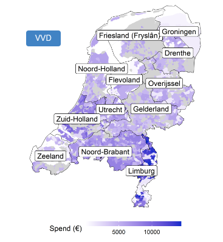
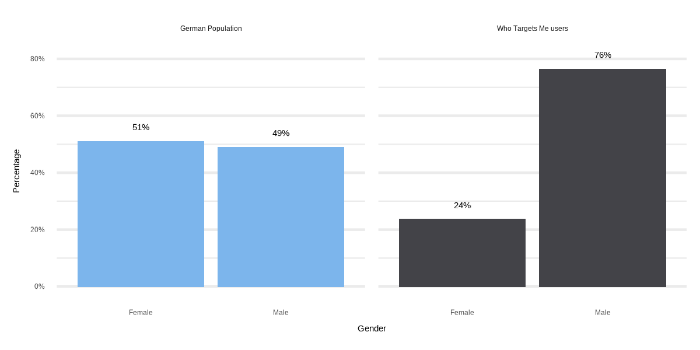
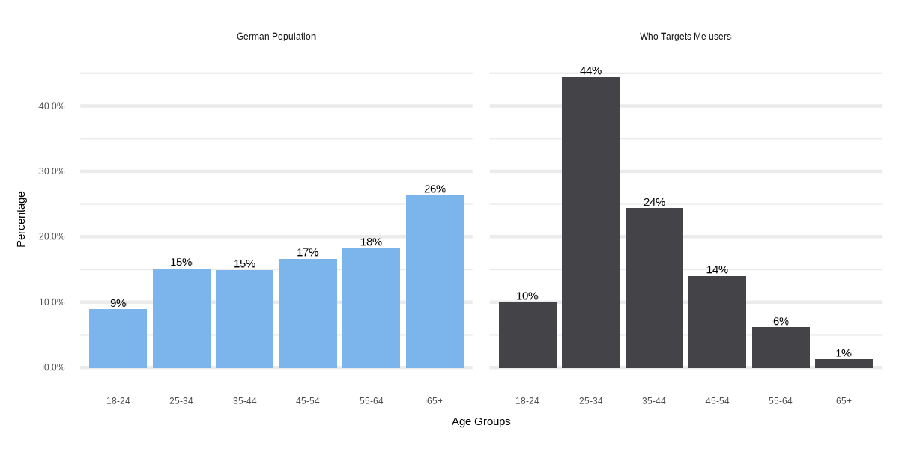
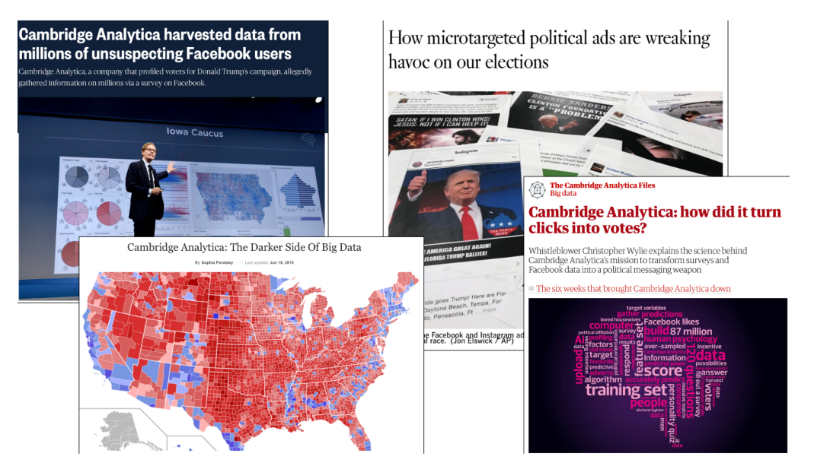
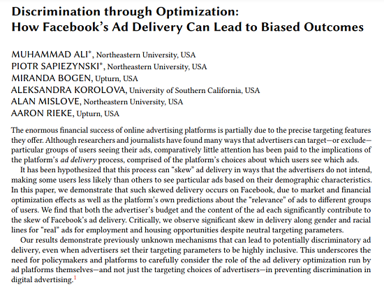
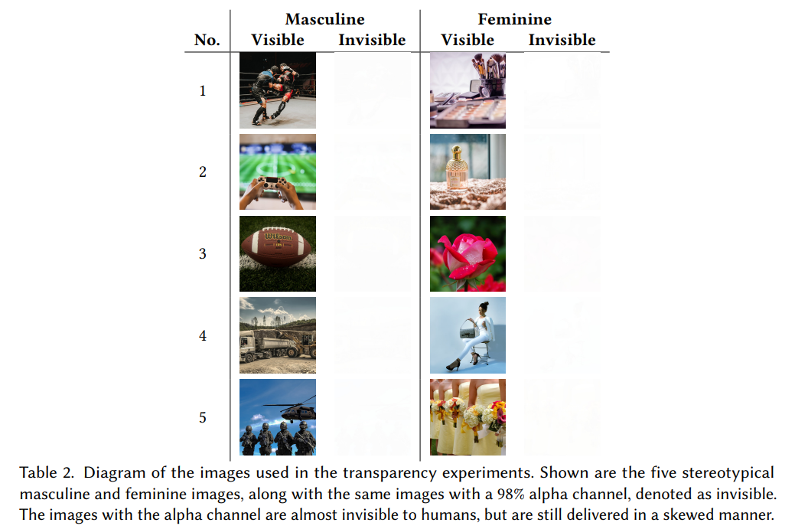

layout: true
    
<div class="logo"></div> 


```{r setup, include=FALSE}
# Here you can place global options for the entire document.
# Mostly used for knitr settings, but can also load data etc.
# Whatever happens here will not show in the presentation.
knitr::opts_chunk$set(fig.retina = 3, 
                      warning = FALSE, 
                      message = FALSE,
                      echo = F)


library(tidyverse)

source("../../../phd/codebase/algo_ads/helpers.R")

overview <- readRDS("../../../phd/codebase/algo_ads/data/overview.rds")

overview_day <- readRDS("../../../phd/codebase/algo_ads/data/overview_day.rds")

# dir("../img", recursive = T, full.names = T) %>%
#   walk(~{file.copy(.x, str_remove(.x, "\\.\\.\\/"))})

```


---


## What is political microtargeting?

> a set of techniques to leverage ***individual-level data*** for the delivery of political messages to specific target groups that are expected to be more ***susceptible*** to them


What does more "susceptible" mean?

Expectation that it is more *effective*

Based on congruency between recipient and message:

+ **congruency** theory (Aker 1999)


TODO:

1. Hook
2. effects of microtargeting
---

## Types of Microtargeting

+ *behavioral targeting* (Dobber et al. 2019)
  
  + e.g. people that engage with political content online
  
--
  
+ *psychographic* or *psychological targeting* (Tufekci 2014, Sharp 2018)

  + matching a person's personality (like their degree of extraversion) to the content of an ad can increase an ad's persuasive power and increase the clicks and conversions it generates (Moon 2002, Wheeler 2008)
  
  +  Nai et al. (2020) show that uncivil attack ads are most effective in lowering perceptions of the attacked politician when the receiver of the message scores high on psychopathy
  
--

+ *issue-based targeting* (Endres 2020)

  + people who care about climate change, economy, abortion rights
  
--

+ *algorithmically enhanced microtargeting* (König 2020)

  + algorithms determine which ads are most "relevant" for each group


---

class: white

### Offline vs. Online Political Microtargeting

.pull-left[

#### Offline


]


.pull-right[


#### Online


]

---

class: white

### Online Political Microtargeting

.pull-left[


]

.pull-right[
**1. Scalability**

- Offline campaigning: limited volunteers & time

- Digital campaigns reach vast audiences quickly

- Analytics refine ad performance

**2. Accessibility**

- Microtargeting techniques available even for budget-limited campaigns

- Use of platform-provided data and own contact lists

- Specialized ad delivery algorithms

]


---

### Not all platforms are the same for political microtargeting

.pull-left[
**Meta**  allows targeting based on:
  + detailed demographics (age, gender, education, etc.)
  + users "interests" 
  + behavioral targeting 
  + custom and lookalike Audiences

**Google** only allows limited targeting 
  + age, gender, location 
  + keywords for political ads
  
**Twitter** disallowed political ads in 2019
  + were brought them back recently (2023)
  + detailed targeting possible (demographics, custom and lookalike audiences)

]

--

.pull-right[
**Snapchat** offers detailed targeting 
  + demographics, custom and lookalike audiences
  + however is relatively understudied (e.g. Tanusondjaja 2023)
  

**TikTok** disallows political ads 
  + but researchers have documented its use: https://tiktok-audit.com/blog/2023/tiktok_political_ads/

]


---


class: center, middle, white

## Microtargeting and Toxic Ads


---

### Going Negative

.pull-left[

Negative campaigning (*going negative*) is a common strategy used by political campaigns 

  + attack opponents 
  + highlight their personal flaws (Geer 2006).
  + point out their voting records

There is a *negativity bias* in human information processing that draws more attention to negative information (Fiske, 1980; Hilbig, 2009; Rozin & Royzman, 2001)

]

.pull-right[


]


---


### Going negative may backfire

.pull-left[


+ However, negative ads can also **backfire** (***backlash effect***) 
  + generate sympathy for the target
  + reduce attitudes towards the attacker (Garramone 1984; Walter & van der Eijk, 2019)

+ Negative campaigning is seen as undesirable and harmful by the public
    + (Mutz and Reeves 2005; Mattes and Redlawsk 2014)

+ So when should campaigns "go negative"? 

  + Weighting the rewards and risks (Haselmayer 2019)

]


--

.pull-right[


]


---


## Microtargeting and Toxicity

Microtargeting may lower the risk of backlash effects because:

+ Toxic messages can be targeted towards individuals who are most susceptible to them (Nai & Maier 2020)

  + also means: people likely to dislike toxicity can be excluded

+ A smaller range of individuals are affected if there were to be a backlash

*Hypotheses:*

> H1a: Microtargeted ads from political campaigns are more toxic than ads targeted at more general audiences.

> H1b: Outside groups should be less concerned about reputational hits and therefore show a smaller effect.


---

class: white

## Methods

.pull-left[

**Meta Ad Library API**

  + 912k ads in three months before election day (August 3rd - November 3rd 2020)
  
**Scrape Images and Videos**

  + `metatargetr`
  
  
**Extract Text from Images and Videos**

  + Transcripts of Videos using Mozilla DeepSpeech (Hannun et al., 2014)
  + OCR using Google Cloud Vision API
  
**Toxicity**

  + Scoring via Google's Perspective API

]

.pull-right[

]

---


## Measurement

+ Dependent Variable: Toxicity (Perspective API)
      
+ Independent Variable: Potential Reach (*Targeting Granularity*)

> `Potential Reach` estimates how many people your ad could potentially reach depending on the targeting and ad placement options you select while creating an ad. ~Facebook Ad Library

--

.pull-left[
+ 100 - 1.000 individuals reached
+ 1.001 - 5.000
+ 5.001 - 10.000
+ 10.001 - 50.000
+ 50.001 - 100.000
+ 100.001 - 500.000
+ 500.001 - 1 million
+ +1 million
]

.pull-right[
  <br>
  <br>
  <br>
  The smaller the reach the more microtargeted is an advertisement.
]

Analysis: Multilevel Ordinal Logistic Regression (2nd level: advertiser pages)


---

class: white

## Results


---

class: center, middle

## Deeper Dive into Methods

---


class: center, middle, white

### Meta Ad Library (API)


]

---

class: white

### Meta Ad Library (API)

.pull-left[

+ Meta Ad Library gives access to:

  + Ads about social issues, elections or politics that have run in the past seven years

  + You can get the text, run time (dates), spending, impressions (by age, gender, and location)
  
  + **NEW** since August 2023 *only in EU*: age, gender, and location targeting criteria (thank you DSA!)
  
+ In order to get access you need:

  + A **verified** Meta Developer account (i.e. you need to send in your ID to confirm identity 🤔)
  
  + The steps are outlined here: https://www.facebook.com/ads/library/api/

]

.pull-right[


]


---

class: white

### Meta Ad Library (API) - It's not enough!

.pull-left[

**HOWEVER** Meta Ad Library has been criticized (Dommett & Power, 2023; Edelson et al., 2020; Leerssen et al., 2019):

+ It does not include all political ads
  
+ It includes many ads that are not political
  
+ It does not include the actual targeting criteria used (*only recently in EU and not all of them*)
  
+ Broad spending and impression boundaries make it hard to compare these metrics across accounts

]

.pull-right[


]


---

class: center, white


---


class: white

### Introducing `metatargetr`


Link: https://github.com/favstats/metatargetr

---


class: white

.leftcol75[

### `metatargetr`

]

.rightcol25[


```{r, echo = F, out.width=100, out.height=100, fig.align='right'}
knitr::include_graphics("https://github.com/favstats/metatargetr/raw/master/man/figures/metatargetr_logo.png")
```

]


The main function is: `get_targeting`:


---


class: white

.leftcol75[

### Transparency during Elections

]

.rightcol25[


```{r, echo = F, out.width=100, out.height=100, fig.align='right'}
knitr::include_graphics("https://github.com/favstats/metatargetr/raw/master/man/figures/metatargetr_logo.png")
```

]


.pull-left[

This has allowed me to create election dashboards



[Blog Post](https://www.favstats.eu/post/provincial_elections/)

]

.pull-right[

+ 🇸🇪 [2022 Swedish general election](https://favstats.github.io/SwedishElection2022/)
+ 🇺🇸 [2022 United States midterm elections](https://whotargetsme.github.io/midterms2022_dashboard/) 
+ 🇮🇹 [2023 Lazio & Lombardy regional election](https://favstats.github.io/regionali2023/) 
+ 🇪🇪 [2023 Estonian parliamentary election](https://favstats.github.io/EstoniaElection2023/) 
+ 🇳🇱 [2023 Dutch provincial elections](https://favstats.github.io/ProvincialeStatenverkiezingen2023/) 
+ 🇲🇪 [2023 Montenegrin presidential elections](https://refined-github-html-preview.kidonng.workers.dev/favstats/MontenegroPresidentialElection2023/raw/dc4d9baafe3f30b7d79e45206f63c745f51a25b3/index.html) 
+ 🇦🇺 [2023 New South Wales state election](https://favstats.github.io/NSWAustralianElection2023/) 
+ 🇫🇮 [2023 Finnish parliamentary election](https://favstats.github.io/FinlandElections2023/) 
+ 🇹🇷 [2023 Turkish general election](https://refined-github-html-preview.kidonng.workers.dev/favstats/TurkishElection2023/raw/ce6281fe74b8f5a3f99c576c31bd95758cf80dec/index.html) 
+ 🇩🇪 [2023 Bremen State election](https://favstats.github.io/BremenStateElection2023/)
+ 🇬🇷 [2023 Greek Legislative election](https://favstats.github.io/GreeceElection2023/) 
+ 🇹🇷 [2023 Turkish general election](https://favstats.github.io/TurkishElection2023/) 
+ 🇲🇪 [2023 Montenegrin parliamentary elections](https://favstats.github.io/2023MontenegrinParliamentaryElection/) 
+ 🇳🇱 [2023 Dutch parliamentary elections](https://favstats.github.io/TK2023/) 
+ 🇺🇸 [2024 US Presidential Primaries](https://favstats.github.io/USprimaries2024/)

]


---


class: white

.leftcol75[

### Transparency during Elections

]

.rightcol25[


```{r, echo = F, out.width=100, out.height=100, fig.align='right'}
knitr::include_graphics("https://github.com/favstats/metatargetr/raw/master/man/figures/metatargetr_logo.png")
```

]

.rightcol60[


]


---


class: center, middle, white


---


class: white

.leftcol75[

### Downloading Images and Videos

]

.rightcol25[


```{r, echo = F, out.width=100, out.height=100, fig.align='right'}
knitr::include_graphics("https://github.com/favstats/metatargetr/raw/master/man/figures/metatargetr_logo.png")
```

]

With `metatargetr` you can also download the images and videos of any ad!

Just use the function `get_ad_snapshot` on any ad id:


---

class: white

#### Now that we have image and videos, what can we do with that?

+ Extract texts from images and videos

+ Detect emotions in music, speech or color schemes (Mendoza 2023, work in progress)


---

class: white, middle, center

## Optical Character Recognition (OCR)


---

class: white

## Optical Character Recognition (OCR)

.pull-left[

+ Tesseract Engine ([tesseract R package](https://cran.r-project.org/web/packages/tesseract/vignettes/intro.html))


+ Huggingface - Keyword: OCR ([e.g. TrOCR](https://huggingface.co/microsoft/trocr-base-printed))

  + access from R using [huggr](https://github.com/benjaminguinaudeau/huggr)

]


.pull-right[
  Google Vision API (try [here](https://cloud.google.com/vision/docs/drag-and-drop))
  
  
  
  + [googleCloudVisionR](https://github.com/emartech/googleCloudVisionR)
  + [Python Client for Google Cloud Vision](https://cloud.google.com/python/docs/reference/vision/latest)
]


---

## Video to Audio to Text

.pull-left[


The best approach to turn video to audio is the library [`FFmpeg`](https://ffmpeg.org)

  + A complete, cross-platform solution to record, convert and stream audio and video
  
Once you obtained audio:

  + I utilized Mozilla DeepSpeech (Hannun et al., 2014)
  
**HOWEVER**: 

  + I would now recommend [`whisper`](https://github.com/openai/whisper) from OpenAI
  

]


.pull-right[

]
  

---

class: middle, center, white

# TOXICITY


---

## Perspective API - Models

| Model name                 | Type  | Description                                                                                                                                                                                                                                                                             | Available Languages                                                                               |
|--------------------------------|-------|-----------------------------------------------------------------------------------------------------------------------------------------------------------------------------------------------------------------------------------------------------------------------------------------|---------------------------------------------------------------------------------------------------|
| `TOXICITY`                     | prod. | A rude, disrespectful, or unreasonable comment that is likely to make people leave a discussion.                                                                                                                                                                                        | English (en), Spanish (es), French (fr), German (de), Portuguese (pt), Italian (it), Russian (ru) |
| `TOXICITY_EXPERIMENTAL`        | exp.  | ^[]                                                                                                                                                                                       | Arabic (ar)                                                                                       |
<br>
<br>

> What is Perspective? Perspective is a free API that uses machine learning to identify toxic comments, making it easier to host better conversations online.

---


## Perspective API - Models

| Model name                 | Type  | Description                                                                                                                                                                                                                                                                             | Available Languages                                                                               |
|--------------------------------|-------|-----------------------------------------------------------------------------------------------------------------------------------------------------------------------------------------------------------------------------------------------------------------------------------------|---------------------------------------------------------------------------------------------------|
| `SEVERE_TOXICITY`              | prod. | A very hateful, aggressive, disrespectful comment or otherwise very likely to make a user leave a discussion or give up on sharing their perspective. This attribute is much less sensitive to more mild forms of toxicity, such as comments that include positive uses of curse words. | en, fr, es, de, it, pt, ru                                                                        |
| `SEVERE_TOXICITY_EXPERIMENTAL` | exp.  | ^[] | ar                                                                                                |
| `IDENTITY_ATTACK`              | prod. | Negative or hateful comments targeting someone because of their identity.                                                                                                                                                                                                               | de, it, pt, ru, en                                                                                |
| `IDENTITY_ATTACK_EXPERIMENTAL` | exp.  | ^[]                                                                                                                                                                                                              | fr, es, ar                                                                                        |
| `INSULT`                       | prod. | Insulting, inflammatory, or negative comment towards a person or a group of people.                                                                                                                                                                                                     | de, it, pt, ru, en                                                                                |
| `INSULT_EXPERIMENTAL`          | exp.  | ^[]                                                                                                                                                                                                   | fr, es, ar                                                                                        |

---


## Perspective API - Models

| Model name                 | Type  | Description                                                                                                                                                                                                                                                                             | Available Languages                                                                               |
|--------------------------------|-------|-----------------------------------------------------------------------------------------------------------------------------------------------------------------------------------------------------------------------------------------------------------------------------------------|---------------------------------------------------------------------------------------------------|                                                                                     |
| `PROFANITY`                    | prod. | Swear words, curse words, or other obscene or profane language.                                                                                                                                                                                                                         | de, it, pt, ru, en                                                                                |
| `PROFANITY_EXPERIMENTAL`       | exp.  | ^[]                                                                                                                                                                                                                       | fr, es, ar                                                                                        |
| `THREAT`                       | prod. | Describes an intention to inflict pain, injury, or violence against an individual or group.                                                                                                                                                                                             | de, it, pt, ru, en                                                                                |
| `THREAT_EXPERIMENTAL`          | exp.  | ^[]                                                                                                                                                                                             | fr, es, ar                                                                                        |
| `SEXUALLY_EXPLICIT`            | exp.  | Contains references to sexual acts, body parts, or other lewd content.                                                                                                                                                                                                                  | en                                                                                                |
| `FLIRTATION`                   | exp.  | Pickup lines, complimenting appearance, subtle sexual innuendos, etc.                                                                                                                                                                                                                   | en      

---

class: white


## peRspective R package


Link: https://github.com/favstats/peRspective

---

class: white

.leftcol75[

### peRspective R package

]

.rightcol25[


```{r, echo = F, out.width=100, out.height=100, fig.align='right'}
knitr::include_graphics("https://github.com/favstats/peRspective/raw/master/man/figures/perspective.png")
```

]


.pull-left[

`my_text <- "You wrote this? Wow. This is dumb and childish, please go f**** yourself."`

prsp_score(`
           `text = my_text,` 
           `languages = "en",`
           `score_model = peRspective::prsp_models`
           `)`


]

.pull-right[


]


---

## Takeaways


+ Political microtargeting allows campaigns to deliver customized messages to specific groups expected to be more susceptible to them. 

  + It aims to increase message effectiveness through congruency between recipient and message.

+ Microtargeting techniques include behavioral, psychographic, issue-based and algorithmic targeting. 

   + Online platforms like Meta allow for more advanced targeting compared to platforms like Google.
   
+ Negative campaigning or "going negative" is common, but can backfire. 
  + Microtargeting may reduce this risk by confining toxic messages to receptive groups.

+ Analyzing ads from the Meta Ad Library API shows that microtargeted ads tend to be more toxic, supporting the idea that campaigns use targeting to safely unleash negativity.

+ Tools like metatargetr and peRspective enable downloading ad creatives and scoring toxicity, opening up new research avenues.


+ Overall, political microtargeting facilitates effectively matching recipients to toxic message content, raising ethical questions about manipulation, transparency and accountability.


---


class: center, middle

### Targeting during 2021 German Bundestag elections

#### Collaboration with Who Targets Me

---

class: white

## Who Targets Me

.pull-left[


]

.pull-right[

]

---


class: white

### Who Targets Me


.pull-left[

+ ZDF Magazin Royale collaborates with Who Targets Me (April 2021)

+ 17k users in Germany sign up with WTM in the next months

+ only ~5k users (~30%) see political ads

+ 150k political ad impressions

+ I join the project end of July 2021

]

.pull-right[


]


---

class: white

### ZDF Magazine Royale Show 24. September 2021


https://targetleaks.de/


---

class: white

## Why Am I Seeing This

+  WTM users share the text from the ‘Why am I seeing this?’ label


---


class: white

## Political Advertisers in Germany


---

class: white

## Bias in data - Gender

--




---

class: white

## Bias in data - Age





---


class: white

## Bias in data - Bundesland


---


## Solution - Weighting

+ Weighting is a common procedure when working with survey data to enhance *representability* after data was collected

+ Detailed [blog post](https://www.pewresearch.org/decoded/2020/03/26/weighting-survey-data-with-the-pewmethods-r-package/) about how to use `pewmethods` for weighing


---

class: white

### Weighting the data 

#### according to German population metrics


---


class: white

### How common is targeting anyway?


.rightcol30[

Link to Shiny app to explore results:

[favstats.shinyapps.io/btw21_wtm/](https://favstats.shinyapps.io/btw21_wtm/)

]


---

class: white

### Targeting Networks - CDU


---

class: white

### Targeting vaccine skeptic content

.pull-left[


]

.pull-right[

]

---

class: white

### Targeting vaccine skeptic content

.pull-left[


]


.pull-right[
> I myself am neither a fanatical opponent of vaccination nor a supporter of it: because the main successes against this virus take place in our immune systems anyway, when they - spared from stress and environmental damage - fend off germs and cause an inconspicuous infection process.
]


---

class: white

## Attack Ads - CDU

.pull-left[
This CDU ad is targeted at 

+ small business owners
+ interest in business management
+ female entrepreneurs
+ start-ups
+ “The Economist” 
+ entrepreneurship
]

.pull-right[


]


---

## Takeaways

+ Data donation studies may require weighting because of self-selection bias

  + R package `pewmethods` can help create weights

+ Who Targets Me helps create transparency around elections

  + they are very open to research and can be approached if you would like to conduct studies

---

class: white. middle, center

# The Role of Algorithms 

# in Political Microtargeting


---


### Online Political Microtargeting of Political Ads - the "bad actors"-story
 
 
.pull-left[



] 
  
  

---


### Online Political Microtargeting of Political Ads - the "bad actors"-story
 
 
.pull-left[


*The explicit assumption here that advertisers typically have strong control over who sees which ad*

] 
  
  
--

.pull-right[

**But there is more than *just* targeting criteria that decides who sees political ads:**

+ advertisers can set targeting *boundaries*

+ *ad delivery algorithms* "decide" which individual users get ads from which advertiser

]


---

class: center, middle, white


<!--  -->


---

class: center, middle, white

<!--  -->


---


class: center, middle, white

<!--  -->


---


class: center, middle, white

<!--  -->


---

class: center, middle, white

<!--  -->


---

### Who decides who sees which ad on Meta?

+ **Ad auctions** = an auction takes place that determines which ad by whom is shown

<center>

</center>

---

### Who decides who sees which ad on Meta?

+ **Relevance** = how relevant is the ad to the user

```{r, out.width="70%", echo = F}
knitr::include_graphics("img/relevant_quote.png")
```

[(Meta Business Help Center, 2022)](https://www.facebook.com/business/help/430291176997542)

---


### Who decides who sees which ad on Meta?

+ **Ad auctions** = an auction takes place that determines which ad by whom is shown: based on *budget*

+ **Relevance** = how relevant is the ad to the user

<center>

</center>

--

##### *Ad delivery algorithms* finding *relevant* audiences for ads: we term this **algorithmic microtargeting**


---


### Pricing differences in the US 2020 election

+ Biden campaign paid more than **6x more** 
  + compared to Trump campaign when targeting older voters. [(The Markup 2020)](https://themarkup.org/election-2020/2020/10/29/facebook-political-ad-targeting-algorithm-prices-trump-biden)
  
  
<center>
```{r, out.width="60%", echo = F}
knitr::include_graphics("img/older.png")
```
</center>
  
<!--  -->
  

---


### Prior Research into Ad Delivery Algorithms

**Job ads and Housing**

* Discrimination in Online Ad Delivery [(Sweeney, 2013)](https://doi.org/10.1145/2460276.2460278) 

* Algorithmic bias? An empirical study of apparent gender-based discrimination in the display of stem career ads [(Lambrecht and Tucker, 2019)](https://doi.org/10.1287/mnsc.2018.3093) 

* Auditing Race and Gender Discrimination in Online Housing Market [(Asplund et al., 2020)](https://ojs.aaai.org/index.php/ICWSM/article/view/7276) 

* Auditing for Discrimination in Algorithms Delivering Job Ads [(Imana et al., 2021)](https://ant.isi.edu/datasets/addelivery/Discrimination-Job-Ad-Delivery.pdf) 

---


class: white

### Prior Research (Ali et al., 2020,2021)

.pull-left[

]


.pull-right[

]


---

### Prior Research (Ali et al., 2020,2021)


When targeting the same audience, at the same time, with the same budget:

+ Ad delivery is heavily skewed along gendered and racial stereotypes
  + even without the intent of the advertiser [(Ali et al. 2020)](https://dl.acm.org/doi/10.1145/3359301)
  
--

.pull-left[
**Delivery remains skewed even with blank image**

Images invisible to humans but still detectable by algorithm:

+ yield **similar skews** in delivery

+ highlights importance of algorithm

+ less based on differences in user behavior/preferences
]

.pull-right[

]


---

### Prior Research (Ali et al., 2020,2021)


When targeting the same audience, at the same time, with the same budget:

Regarding political ads [(Ali et al., 2021)](https://dl.acm.org/doi/pdf/10.1145/3437963.3441801):

--

.pull-left[
+ **Skewed delivery**

  + Political ads more often delivered to ideologically congruent audience 
      + Bernie ads → higher % D; 
      + Trump ads → higher % R

+ **Increased cost**

  + Liberal ad to a liberal audience: *21 Dollar per 1000 users*; 
  + Conservative ad delivered to liberal audience: *40 Dollar per 1000 users*.
]

--

.pull-right[
**Results hold** 

+ when tricking Facebook into classifying non-partisan ads as partisan


]

---


class: white


---

class: center, middle

## Research Question

### How does the Meta ad delivery algorithm<br>influence the pricing & distribution of political ads<br>in the Netherlands?

---

class: center, middle

# Research Design

---

### Research Design

+ Algorithm audit study

+ Place the same ads targeting the same audiences (9 different ones)

--

+ Collaborate with Dutch parties to place political ads

+ Final collaboration with 3: 

  1. GroenLinks (Green party)
  2. VVD (centre-right party of PM Rutte)
  3. PvdA (social democrats)
  

--

+ Place ads before nationwide local elections on March 16th 2022
  + 1st to 7th February 2022

+ Spend 2 Euros a day on 45 ad copies

  + in total: 630 Euro per party
  
  
--
  
+ Pre-registered research design and hypotheses

---


### Dependent Variables

+ Price per 1k users reached

  + this measure is an industry standard

+ Ad delivery share

  + Audience shares measured by % of ads delivered to specific group
  
  + "How many people were reached in Audience A vs. Audience B"
  
  + Pairwise setup which allows us to observe presence and absence of target audience
  
     + e.g. ~60% of audience was interested in politics vs. 40% was not


---

### Within- and between-party comparisons

The study design incorporates two *levels of comparisons*

<br>

Observing differences of **pricing and delivery**:


  1. *between parties*
  
    + i.e. we expect pricing and delivery to differ by party

  1. *within a party*
  
    + i.e. we expect pricing and delivery to differ by audience


---


### Ad Relevance


We theorize two different levels of (predicted) relevance:

--

1. Relevant audience for party (i.e. source of ad)

--

+ Ads from an environmentalist party more likely to be relevant for audience interested in environmentalism.

<br>

--

<ol start="2">
  <li>Relevant audience for ad content (e.g. political message)</li>
</ol>


--

+ Political message likely to be relevant for people interested in politics

---


### Hypotheses


[(Meta Business Help Center, 2022)](https://www.facebook.com/business/help/430291176997542)


> **H1:** **The more relevant** an audience is for an ad, **the cheaper is the cost** for reaching 1000 users in that audience.

> **H2:** **The more relevant** an audience is for an ad, **the more are ads delivered** to that audience.

--

We expect that ads by party with a greater share of supporters are less expensive (H3a) and reach more people (H3b)

> **H3a:** Parties with a greater share of supporters pay less for reaching 1000 users.

> **H3b:** Parties with a greater share of supporters reach more people than smaller parties.


---

### Targeting criteria (Sub-hypotheses for H1 & H2)


We used 9 different (paired) targeting criteria for our advertisements

.pull-left[

1. Political interests
2. Excluding political interest
  

<ol start="3">
  <li>Higher educated audience</li>
  <li>Lower educated audience</li>
</ol>


]

.pull-right[

**Relevant audiences for ad content**

> Targeting political ads to **politically interested** and **higher-educated** audiences

> *is less expensive* 

> *deliver more* 

> than targeting politically uninterested and lower-educated audiences. 


]

---

### Targeting criteria (Sub-hypotheses for H1 & H2)


We used 9 different (paired) targeting criteria for our advertisements

.pull-left[

1. Political interests
2. Excluding political interest
  
<ol start="3">
  <li>Higher educated audience</li>
  <li>Lower educated audience</li>
</ol>

<ol start="5">
  <li>Environmental interests</li>
  <li>Excluding environmental interests</li>
</ol>

<ol start="7">
  <li>Economic interests</li>
  <li>Excluding Economic interests</li>
</ol>

]

.pull-right[


**Relevant audience for party**


> Targeting political ads to issues that party has issue ownership over

>  *is less expensive* 

>  *delivers more* 

compared to other parties

]


---


### Targeting criteria (Sub-hypotheses for H1 & H2)


We used 9 different (paired) targeting criteria for our advertisements

.pull-left[

1. Political interests
2. Excluding political interest

<ol start="3">
  <li>Higher educated audience</li>
  <li>Lower educated audience</li>
</ol>

<ol start="5">
  <li>Environmental interests</li>
  <li>Excluding environmental interests</li>
</ol>

<ol start="7">
  <li>Economic interests</li>
  <li>Excluding Economic interests</li>
</ol>
  
<ol start="9">
  <li>No Targeting</li>
</ol>

]


---

class: center, middle

# Ad Creative and Setup

---

## How the ad looked like on Desktop


<p style="clear: both;">


---

## How the ad looked like on Desktop


---


class: center, middle

## Results


---

class: center, white, middle

### Between-party differences

$\rightarrow$ we consistently find one party that pays less and reaches more people 


---

class: white

#### Between-party differences (per individual ad)

.font80[PvdA pays the least (**10-12 cents less** or: 8-10%) & reaches more people (~**1.1 - 1.3k more** per ad)]


.pull-left[


```{r, echo=F}

share_dat <- overview %>% 
  drop_na(ad_name) %>%
  # set_names(names(overview_uva)) %>% 
  mutate(pair = readr::parse_number(ad_set_name)) %>% 
  mutate(comparison = case_when(
    str_detect(ad_name, "Economy") ~ "Economy",
    str_detect(ad_name, "Environment") ~ "Environment",
    str_detect(ad_name, "Education") ~ "Education",
    str_detect(ad_name, "Politics") ~ "Politics",
    T ~ NA_character_
  )) %>% 
  drop_na(comparison) %>% 
  # count(ad_name)
  group_by(pair, comparison, party) %>% 
  mutate(total = sum(reach),
         share = reach/total*100) %>% 
  ungroup()

overview %>% #filter(is.na(targeting))
  drop_na(targeting) %>% 
  # filter(targeting == "No Targeting") %>%
  mutate(party = fct_relevel(party, c("PvdA", "GroenLinks", "VVD"))) %>% 
  ggplot(aes(party, cost_per_1_000_people_reached)) + # Move y and x here so than they can be used in stat_*
  geom_jitter(width = 0.2) +
  geom_boxplot(aes(color = party), width = 0.2) +
  # stat_summary(aes(color = party), fun = mean, fun.min = mean, fun.max = mean,
  #              geom = "crossbar", width = 0.5) +
  scale_color_parties() +
  theme_minimal() +
  theme(legend.position = "none", plot.title = element_text(size = 19, face = "bold")) +
  # ggpubr::stat_compare_means() +
  EnvStats::stat_mean_sd_text(digits = 2) +
  labs(y = "Cost per 1000 users reached\nin Euros (across all conditions)", x = "Party", title = "Cost per 1000 users per ad\n") 

share_dat %>% 
    filter(str_detect(targeting, "Higher")) %>% 
    arrange(-share) %>% 
    select(party, reach, share, targeting, relevance)
```


]

--

.pull-right[


```{r, echo=F}


overview %>% 
  drop_na(targeting) %>% 
  # filter(targeting == "No Targeting") %>%
  mutate(party = fct_relevel(party, c("PvdA", "GroenLinks", "VVD"))) %>% 
  ggplot(aes(party, reach)) + # Move y and x here so than they can be used in stat_*
  geom_jitter(width = 0.2) +
  geom_boxplot(aes(color = party), width = 0.2) +
  # stat_summary(aes(color = party), fun = mean, fun.min = mean, fun.max = mean,
  #              geom = "crossbar", width = 0.5) +
  scale_color_parties() +
  theme_minimal() +
  theme(legend.position = "none", plot.title = element_text(size = 19, face = "bold")) +
  # ggpubr::stat_compare_means() +
  EnvStats::stat_mean_sd_text(digits = 0) +
  labs(y = "Reach (across all conditions) per ad", x = "Party", title = "Reach (unique people)\n") 
```


]


---

class: white

#### Between-party differences (per target audience)

--

<!--  -->


---


class: white
#### Between-party differences (zoomed in)

.font80[*Exclude economic interests* or *target environmental interests*:<br>VVD reaches fewer people per ad than GL (**~380-450 fewer people**) and pay more (**4-5 cents more**)]


.pull-left[
```{r}

mod_nobreak_h1cg <- lm(reach ~ targeting * party + engagement, data = overview)

library(modelbased)

contrasts_nobreak_h1cg <- estimate_contrasts(mod_nobreak_h1cg, contrast = c("targeting", "party"),
                                at = c("targeting", "party")) %>% 
  as.data.frame()  %>%  
  mutate(Contrast = paste(Level1, "-", Level2)) %>%  
  mutate(condition_comparison = fct_reorder(Contrast, Difference)) 


ww <- contrasts_nobreak_h1cg %>% 
  filter(str_detect(condition_comparison, "excluded")) %>% 
  filter(str_count(condition_comparison, "Economy excluded") == 2)  %>% 
  mutate(party = str_extract(Level1, "VVD|GroenLinks|PvdA")) %>% 
  filter(str_detect(Level2, "GroenLinks")) %>% 
  bind_rows(contrasts_nobreak_h1cg %>%
  filter(!str_detect(condition_comparison, "excluded")) %>%
  filter(str_count(condition_comparison, "Environment") == 2)  %>%
  mutate(party = str_extract(Level1, "VVD|GroenLinks|PvdA")) %>%
  filter(str_detect(Level2, "GroenLinks"))) %>%
  # bind_rows(contrasts_nobreak_h1cg %>% 
  # filter(!str_detect(condition_comparison, "excluded")) %>%
  # filter(str_count(condition_comparison, "Economy") == 2)  %>% 
  # mutate(party = str_extract(Level1, "VVD|GroenLinks|PvdA")) %>% 
  # filter(str_detect(Level2, "GroenLinks"))) %>% 
  # bind_rows(contrasts_nobreak_h1cg %>% 
  # filter(!str_detect(condition_comparison, "excluded")) %>%
  # filter(str_count(condition_comparison, "Politics") == 2)  %>% 
  # mutate(party = str_extract(Level1, "VVD|GroenLinks|PvdA")) %>% 
  # filter(str_detect(Level2, "GroenLinks"))) %>% 
  # in case the comparison is in wrong direction, change around
  # mutate_at(vars(Difference, CI_low, CI_high), ~ifelse(str_detect(condition_comparison, "excluded"), .x*-1, .x)) %>%
  # mutate_at(vars(Difference, CI_low, CI_high), ~ifelse(str_count(condition_comparison, "VVD")==2, .x*-1, .x)) %>%
  # mutate_at(vars(Difference, CI_low, CI_high), ~ifelse(str_detect(Level1, "Low"), .x*-1, .x)) %>%
  mutate(condition_comparison = str_remove_all(condition_comparison, "VVD|GroenLinks|PvdA")) %>% 
  mutate(plabel = get_plabs(p)) %>% 
  mutate(diff_label = paste0(round(Difference, 2), plabel)) 
  # count(condition_comparison)
  # mutate(condition_comparison = "Reach of audience interested in the Environment (compared to VVD and Environment excluded)") %>% 
  # mutate(condition_comparison = ifelse(
    # !str_detect(condition_comparison, "excluded"),
    # "Reach of audience interested in the Environment (compared to GroenLinks)",
    # "Reach of audience interested in the Environment (compared to Environment excluded)"
    # )) 
# -> ww

ww %>% 
    ggplot(aes("", Difference, color = party)) + 
    geom_point(position = position_dodge(width = 0.9)) +
    geom_errorbar(aes(ymin = CI_low, ymax = CI_high), width = 0, position = position_dodge(width = 0.9)) +
    geom_text(aes(label = diff_label, x= 0 %>% magrittr::add(1.15), y = Difference), position = position_dodge(width = 0.9), show.legend = F) +
    coord_flip() +
    geom_hline(yintercept = 0, linetype = "dashed") +
  labs(y = "Estimated reach differences",
         x = "Targeting Comparisons") +
    theme_minimal() +
    scale_color_parties() +
    ggtitle("Reach (compared to GroenLinks)") +
    # facet_grid(condition_comparison ~ ., scales= "free_y" ) +
    facet_wrap(~condition_comparison, ncol = 2, scales= "free_y" ) +
    theme(legend.position = "bottom",
          strip.text.y = element_blank(), 
          strip.background = element_rect(fill = "lightgrey")) 


```
]

```{r,eval=F}
overview %>% 
    filter(targeting == "Economy excluded") %>% 
    group_by(party) %>% 
    summarise(reach = max(reach))

overview %>% 
    filter(targeting == "Environment") %>% 
    group_by(party) %>% 
    summarise(reach = max(reach))
```


.pull-right[

```{r}
mod_nobreak_h1cg <- lm(cost_per_result ~ targeting * party + engagement, data = overview)

```

```{r}
library(modelbased)

contrasts_nobreak_h1cg <- estimate_contrasts(mod_nobreak_h1cg, contrast = c("targeting", "party"),
                                at = c("targeting", "party")) %>% 
  as.data.frame()  %>%  
  mutate(Contrast = paste(Level1, "-", Level2)) %>%  
  mutate(condition_comparison = fct_reorder(Contrast, Difference)) 


ww <- contrasts_nobreak_h1cg %>% 
  filter(str_detect(condition_comparison, "excluded")) %>% 
  filter(str_count(condition_comparison, "Economy excluded") == 2)  %>% 
  mutate(party = str_extract(Level1, "VVD|GroenLinks|PvdA")) %>% 
  filter(str_detect(Level2, "GroenLinks")) %>% 
  bind_rows(contrasts_nobreak_h1cg %>%
  filter(!str_detect(condition_comparison, "excluded")) %>%
  filter(str_count(condition_comparison, "Environment") == 2)  %>%
  mutate(party = str_extract(Level1, "VVD|GroenLinks|PvdA")) %>%
  filter(str_detect(Level2, "GroenLinks"))) %>%
  # in case the comparison is in wrong direction, change around
  # mutate_at(vars(Difference, CI_low, CI_high), ~ifelse(str_detect(condition_comparison, "excluded"), .x*-1, .x)) %>%
  # mutate_at(vars(Difference, CI_low, CI_high), ~ifelse(str_count(condition_comparison, "VVD")==2, .x*-1, .x)) %>%
  # mutate_at(vars(Difference, CI_low, CI_high), ~ifelse(str_detect(Level1, "Low"), .x*-1, .x)) %>%
  mutate(condition_comparison = str_remove_all(condition_comparison, "VVD|GroenLinks|PvdA")) %>% 
  mutate(plabel = get_plabs(p)) %>% 
  mutate(diff_label = paste0(round(Difference, 2), plabel)) 
  # count(condition_comparison)
  # mutate(condition_comparison = "Reach of audience interested in the Environment (compared to VVD and Environment excluded)") %>% 
  # mutate(condition_comparison = ifelse(
    # !str_detect(condition_comparison, "excluded"),
    # "Reach of audience interested in the Environment (compared to GroenLinks)",
    # "Reach of audience interested in the Environment (compared to Environment excluded)"
    # )) 
# -> ww

ww %>% 
    ggplot(aes("", Difference, color = party)) + 
    geom_point(position = position_dodge(width = 0.9)) +
    geom_errorbar(aes(ymin = CI_low, ymax = CI_high), width = 0, position = position_dodge(width = 0.9)) +
    geom_text(aes(label = diff_label, x= 0 %>% magrittr::add(1.15), y = Difference), position = position_dodge(width = 0.9), show.legend = F) +
    coord_flip() +
    geom_hline(yintercept = 0, linetype = "dashed") +
  labs(y = "Estimated cost differences",
         x = "Targeting Comparisons") +
    theme_minimal() +
    scale_color_parties() +
    ggtitle("Cost (compared to GroenLinks)") +
    # facet_grid(condition_comparison ~ ., scales= "free_y" ) +
    facet_wrap(~condition_comparison, ncol = 2, scales= "free_y" ) +
    theme(legend.position = "bottom",
          strip.text.y = element_blank(), 
          strip.background = element_rect(fill = "lightgrey")) 

```


]


---

class: center, white, middle

### Within-party differences

---


class: white


### Within-party differences


Let's compare now:

Ad price and ad delivery share of 

+ **higher-educated** vs. **lower-educated** audience

+ Audience **interested in the economy** vs. **not interested**

+ Audience **interested in politics** vs. **not interested**

+ Audience **interested in the environment** vs. **not interested**

---


class: white


### Within-party differences - Price per 1k


.pull-left[


Ads **cost less for**:

+ *higher-educated* vs. *lower-educated audience*

Ad price **does not statistically differ for**:

+ Audience *interested in the economy* vs. *not interested*

+ Audience *interested in politics* vs. *not interested*

Ads **cost more for**:

+ Audience *interested in the environment* vs. *not interested*


]

.pull-right[


]

---

class: white, middle center

**18-24 year olds and women are reached less (and cost more to reach)**


---

class: center, middle

## Summary


---

### Summary

Our findings do not always align with expectations.

H1: More "relevant" audiences were not always cheaper

H2: More "relevant" audiences were not always reached more

H3: Party with greatest audience did not reach more or get cheaper prices

--

**However:**

> We **still** find that Meta ad delivery algorithm prioritizes certain parties and audiences for political advertising

1. PvdA pays least and reach most
2. Lower-educated, people interested in environment, women and younger people more expensive to reach

---


### Implications


+ Unequal playing field

  + Meta (dis-)advantages certain parties

  +  the findings presented in this paper show that political parties were not charged the same price for the same service
  
--

+ Potential for deepening political, social and geographical inequalities 

  + Some groups of people and regions are **systematically** less likely to receive political advertisements and more expensive to reach

  + isolating these groups from receiving election-related information

--

+ Little to no transparency by Meta about these systematic biases

  + difficult to research and make visible instances of unequal treatment and price discrimination
  + highlighting importance of access to data
  
--
  
+ Simply "banning" microtargeting would be inadequate

  + more power to the black box algorithm
  
---

class: center, middle

## Thank you for your attention! Questions?

Link to presentation: *favstats.github.io/nefca2023*

.pull-left[


]

.pull-right[


]


---


class: center, middle

## Appendix


---


class: center, white, middle

### Within-party differences

Reach and cost **over time**

--

Potential *market shock* on February 4th?


---

class: white


### Within-party differences per day - Reach and Cost

.pull-left[
```{r}
overview_day %>% 
  drop_na(campaign_name) %>% 
  mutate(targeting = fct_relevel(targeting, c("Economy", "Environment", "Politics", "Economy excluded", "Environment excluded", "Politics excluded", "Higher Education", "Lower Education", "No Targeting"))) %>% 
  ggplot(aes(day, reach, color = targeting)) +
  geom_jitter() +
  geom_smooth() +
  facet_wrap(~targeting) +
  theme_minimal() +
  theme(legend.position = "none",
        plot.title = element_text(size = 19, face = "bold"),
        strip.text.y = element_blank(), 
        strip.background = element_rect(fill = "lightgrey"))    +
  ggtitle("Reach over time") 
```
]

--

.pull-right[
```{r}
overview_day %>% 
  drop_na(campaign_name) %>% 
  mutate(engagement_rate = engagement/impressions*1000) %>% 
  mutate(targeting = fct_relevel(targeting, c("Economy", "Environment", "Politics", "Economy excluded", "Environment excluded", "Politics excluded", "Higher Education", "Lower Education", "No Targeting"))) %>% 
  ggplot(aes(day, cost_per_1_000_people_reached, color = targeting)) +
  geom_jitter() +
  geom_smooth() +
  facet_wrap(~targeting) +
  theme_minimal() +
  theme(legend.position = "none",
        plot.title = element_text(size = 19, face = "bold"),
        strip.text.y = element_blank(), 
        strip.background = element_rect(fill = "lightgrey"))   +
  ggtitle("Cost over time") 
```
]


---

class: center, white, middle

### Within-party differences

Reach and cost **over time** and **per party**

$\rightarrow$ party differences remain constant despite *"shock"*


---


class: white

## Price differences per day

.pull-left[

We observe:

*Consistent results*

+ "Market shock" **hits all parties equally**

+ Environment audience consistently *more expensive*

+ Higher educated audience consistently *less expensive*

*Inconsistent results*

+ Audiences interested in economy & politics are typically cheaper except on the day of the spike


]

.pull-right[
```{r, fig.height=6, fig.width=8}
over_time_gg <- readRDS("../../../phd/codebase/algo_ads/data/over_time_gg.rds")

over_time_gg %>% 
  ggplot(aes(day, Difference, shape = party)) +
    # geom_ribbon(aes(ymin = CI_low, ymax = CI_high), width = 0, position = position_dodge(width = 0.9)) +
    geom_errorbar(aes(ymin = CI_low, ymax = CI_high, color = party_color), width = 0, position = position_dodge(width = 0.9)) +

    # geom_line(aes(color = party_color)) +
    geom_point(aes(color = party_color), position = position_dodge(width = 0.9)) +
    # pammtools::geom_stepribbon(aes(ymin = CI_low, ymax = CI_high, fill = party_color), alpha = 0.1) +
    # geom_text(aes(label = diff_label, y = Difference , x = c(0.8, 1.05, 1.4)), position = position_dodge(width = 0.9), show.legend = F) +
    # coord_flip() +
    # geom_text(aes(label = diff_label), nudge_x = 0.1) +
    geom_hline(yintercept = 0, linetype = "dashed") +
    labs(y = "Estimated price differences of reaching 1k users in Euro",
         x = "Estimates per day") +
    theme_minimal() +
    scale_x_continuous(breaks = 1:7,
                 labels = paste0("Day ", 1:7), minor_breaks = NULL) +
    scale_color_manual(values = c("#0066ee", "#e3101c", "#80c31c", "black")) +
    scale_shape_manual(name = "Party", values = c(16, 15, 17), labels = c("PvdA", "GroenLinks", "VVD")) +
  
    # scale_color_parties() +
    # facet_grid(condition_comparison ~ party) +
    # scale_alpha_discrete(range = c(0.25, 1)) +
    facet_wrap(~condition_comparison, ncol = 2) +
    theme(legend.position = "bottom",
          # strip.text.y = element_blank(), 
          strip.background = element_rect(fill = "lightgrey")) +
    guides(color = "none") +
    ggtitle("Price differences per day")

```
]


<!-- --- -->


<!-- ## Summary of within-party differences -->

<!-- -- -->

<!-- + Some audiences **systematically more expensive** and **receive less ads** than others -->

<!--   + Lower Education, Environment interests -->

<!--   + No targeting is cheapest, reaches most -->

<!-- + Mostly **consistent for each party** -->

<!-- + Suspected *"market shock"* on February 4th affects results -->

<!--   + Some evidence that politics and economy audiences might be cheaper were it not for the spike -->


---

class: white

### Price differences per day


<center>

</center>


---

class: white

### Bulk Discount?

```{r}
report_data <- readRDS("../../../phd/codebase/algo_ads/data/report_data.rds")
```


.pull-left[
```{r}
report_data %>% #count(page_name, sort = T) %>% 
  filter(page_name %in% c("GroenLinks", "VVD", "Partij van de Arbeid (PvdA)")) %>%
  mutate(party = case_when(
    str_detect(page_name, "PvdA")  ~ "PvdA",
    T ~ page_name
  )) %>% 
  filter(day <= as.Date("2022-02-09")) %>%
  # filter(day >= as.Date("2022-01-29")) %>% 
  # filter(disclaimer %in% c("GroenLinks", "Partij van de Arbeid (PvdA)", "VVD")) %>%
  # filter(disclaimer == "PvdA")
  # count(disclaimer, sort = T)
  mutate(spent = readr::parse_number(amount_spent_eur)) %>% 
  # filter(spent != 100) %>% 
  ggplot(aes(day, spent, fill = party)) +
  geom_col(position = position_dodge()) +
  scale_fill_parties() +
  theme_minimal() +
  theme(legend.position = "top")
  # geom_smooth(se = F)# +
  # scale_y_log10() 
```


]

.pull-right[
```{r}
report_data %>% 
  filter(page_name %in% c("GroenLinks", "VVD", "Partij van de Arbeid (PvdA)")) %>%
  mutate(party = case_when(
    str_detect(page_name, "PvdA")  ~ "PvdA",
    T ~ page_name
  )) %>% 
  filter(day <= as.Date("2022-02-09")) %>%
  # filter(day >= as.Date("2022-01-29")) %>% 
  # filter(disclaimer %in% c("GroenLinks", "Partij van de Arbeid (PvdA)", "VVD")) %>%
  # filter(disclaimer == "PvdA")
  # count(disclaimer, sort = T)
  mutate(spent = readr::parse_number(amount_spent_eur)) %>% 
  # filter(spent != 100) %>% 
  ggplot(aes(day, number_of_ads_in_library, fill = party))  +
  geom_col(position = position_dodge()) +
  scale_fill_parties() +
  theme_minimal() +
  theme(legend.position = "top")
```


]

---


class: white, middle center

## Skewed delivery 

in terms of gender, age and region

---


class: white

## Differences in delivery by gender

.pull-left[
+ *Line at zero* shows empirical equilibrium of target audiences (i.e. the observed share of men and women in target audience)

+ *Deviation from zero* are algorithmic biases

  + above zero: prioritization
  
  + below zero: de-prioritization

+ Ads *deliver to more men* for every party

+ However: bias towards men seems smaller for GroenLinks
]


.pull-right[
```{r}

gender_dat <- readRDS("../../../phd/codebase/algo_ads/data/gender.rds") %>% 
  filter(gender != "unknown")

gender_audience <- readRDS("../../../phd/codebase/algo_ads/data/audience_joined_gender.rds")

gender_audience %>% 
  filter(gender != "unknown") %>%
  # filter(targeting == "No Targeting") %>%
  # drop_na(campaign_name) %>%
  ggplot(aes(gender, diff)) +
  geom_boxplot() +
  facet_wrap(~party) +
  ggpubr::stat_compare_means() +
  EnvStats::stat_mean_sd_text(digits = 0) +
  theme_minimal()  +
  theme(strip.background = element_rect(fill = "lightgrey")) +
  labs(y = "Difference between audience share and delivery share") +
  ggtitle("Difference between audience share and delivery share") +
  geom_hline(yintercept = 0, linetype = "dashed")
```
]


---

class: white

## Differences in delivery by age group


.pull-left[

+ Ads *deliver less to young people*

  + aged 18-24

+ Consistent for each party

]

--

.pull-right[
```{r}
age_audience <- readRDS("../../../phd/codebase/algo_ads/data/audience_joined_age.rds")


age_audience %>%
  filter(age != "13-17") %>% 
  filter(age != "unknown") %>%
  # filter(targeting == "No Targeting") %>%
  # drop_na(campaign_name) %>%
  ggplot(aes(age, diff)) +
  geom_boxplot() +
  facet_wrap(~party) +
  # ggpubr::stat_compare_means() +
  # EnvStats::stat_mean_sd_text(digits = 0) +
  theme_minimal()  +
  theme(strip.background = element_rect(fill = "lightgrey")) +
  labs(y = "Difference between audience share and delivery share") +
  ggtitle("Difference between audience share and delivery share") +
  geom_hline(yintercept = 0, linetype = "dashed") +
  coord_flip()
```
]


---

class: white

## Region differences

--

.pull-left[

+ Ads deliver more to some regions

  + for example: Limburg, Friesland, Drenthe

+ Ads deliver less to other regions

  + Utrecht, North Holland, North Brabant

+ Consistent for each party


]

--

.pull-right[
```{r}
region_audience <- readRDS("../../../phd/codebase/algo_ads/data/audience_joined_region.rds")


region_audience %>%
  filter(age != "13-17") %>% 
  filter(age != "unknown") %>%
  mutate(region = fct_reorder(region, diff)) %>% 
  # filter(targeting == "No Targeting") %>%
  # drop_na(campaign_name) %>%
  ggplot(aes(region, diff)) +
  geom_boxplot() +
  facet_wrap(~party) +
  # ggpubr::stat_compare_means() +
  # EnvStats::stat_mean_sd_text(digits = 0) +
  theme_minimal()  +
  theme(strip.background = element_rect(fill = "lightgrey")) +
  labs(y = "Difference between audience share and delivery share") +
  ggtitle("Difference between audience share and delivery share") +
  geom_hline(yintercept = 0, linetype = "dashed") +
  coord_flip()
```
]

---


class: white
#### Between-party differences

.font80[If we exclude economic interests/target environmental interests: VVD reaches less people and cheaper than GL]


.pull-left[
```{r}

mod_nobreak_h1cg <- lm(reach ~ targeting * party + engagement, data = overview)

library(modelbased)

contrasts_nobreak_h1cg <- estimate_contrasts(mod_nobreak_h1cg, contrast = c("targeting", "party"),
                                at = c("targeting", "party")) %>% 
  as.data.frame()  %>%  
  mutate(Contrast = paste(Level1, "-", Level2)) %>%  
  mutate(condition_comparison = fct_reorder(Contrast, Difference)) 


ww <- contrasts_nobreak_h1cg %>% 
  filter(str_detect(condition_comparison, "excluded")) %>% 
  filter(str_count(condition_comparison, "Economy excluded") == 2)  %>% 
  mutate(party = str_extract(Level1, "VVD|GroenLinks|PvdA")) %>% 
  filter(str_detect(Level2, "GroenLinks")) %>% 
  bind_rows(contrasts_nobreak_h1cg %>%
  filter(!str_detect(condition_comparison, "excluded")) %>%
  filter(str_count(condition_comparison, "Environment") == 2)  %>%
  mutate(party = str_extract(Level1, "VVD|GroenLinks|PvdA")) %>%
  filter(str_detect(Level2, "GroenLinks"))) %>%
  # bind_rows(contrasts_nobreak_h1cg %>% 
  # filter(!str_detect(condition_comparison, "excluded")) %>%
  # filter(str_count(condition_comparison, "Economy") == 2)  %>% 
  # mutate(party = str_extract(Level1, "VVD|GroenLinks|PvdA")) %>% 
  # filter(str_detect(Level2, "GroenLinks"))) %>% 
  # bind_rows(contrasts_nobreak_h1cg %>% 
  # filter(!str_detect(condition_comparison, "excluded")) %>%
  # filter(str_count(condition_comparison, "Politics") == 2)  %>% 
  # mutate(party = str_extract(Level1, "VVD|GroenLinks|PvdA")) %>% 
  # filter(str_detect(Level2, "GroenLinks"))) %>% 
  # in case the comparison is in wrong direction, change around
  # mutate_at(vars(Difference, CI_low, CI_high), ~ifelse(str_detect(condition_comparison, "excluded"), .x*-1, .x)) %>%
  # mutate_at(vars(Difference, CI_low, CI_high), ~ifelse(str_count(condition_comparison, "VVD")==2, .x*-1, .x)) %>%
  # mutate_at(vars(Difference, CI_low, CI_high), ~ifelse(str_detect(Level1, "Low"), .x*-1, .x)) %>%
  mutate(condition_comparison = str_remove_all(condition_comparison, "VVD|GroenLinks|PvdA")) %>% 
  mutate(plabel = get_plabs(p)) %>% 
  mutate(diff_label = paste0(round(Difference, 2), plabel)) 
  # count(condition_comparison)
  # mutate(condition_comparison = "Reach of audience interested in the Environment (compared to VVD and Environment excluded)") %>% 
  # mutate(condition_comparison = ifelse(
    # !str_detect(condition_comparison, "excluded"),
    # "Reach of audience interested in the Environment (compared to GroenLinks)",
    # "Reach of audience interested in the Environment (compared to Environment excluded)"
    # )) 
# -> ww

ww %>% 
    ggplot(aes("", Difference, color = party)) + 
    geom_point(position = position_dodge(width = 0.9)) +
    geom_errorbar(aes(ymin = CI_low, ymax = CI_high), width = 0, position = position_dodge(width = 0.9)) +
    geom_text(aes(label = diff_label, x= 0 %>% magrittr::add(1.15), y = Difference), position = position_dodge(width = 0.9), show.legend = F) +
    coord_flip() +
    geom_hline(yintercept = 0, linetype = "dashed") +
  labs(y = "Estimated reach differences",
         x = "Targeting Comparisons") +
    theme_minimal() +
    scale_color_parties() +
    ggtitle("Reach (compared to GroenLinks)") +
    # facet_grid(condition_comparison ~ ., scales= "free_y" ) +
    facet_wrap(~condition_comparison, ncol = 2, scales= "free_y" ) +
    theme(legend.position = "bottom",
          strip.text.y = element_blank(), 
          strip.background = element_rect(fill = "lightgrey")) 


```
]


.pull-right[

```{r}
mod_nobreak_h1cg <- lm(cost_per_result ~ targeting * party + engagement, data = overview)

```

```{r}
library(modelbased)

contrasts_nobreak_h1cg <- estimate_contrasts(mod_nobreak_h1cg, contrast = c("targeting", "party"),
                                at = c("targeting", "party")) %>% 
  as.data.frame()  %>%  
  mutate(Contrast = paste(Level1, "-", Level2)) %>%  
  mutate(condition_comparison = fct_reorder(Contrast, Difference)) 


ww <- contrasts_nobreak_h1cg %>% 
  filter(str_detect(condition_comparison, "excluded")) %>% 
  filter(str_count(condition_comparison, "Economy excluded") == 2)  %>% 
  mutate(party = str_extract(Level1, "VVD|GroenLinks|PvdA")) %>% 
  filter(str_detect(Level2, "GroenLinks")) %>% 
  bind_rows(contrasts_nobreak_h1cg %>%
  filter(!str_detect(condition_comparison, "excluded")) %>%
  filter(str_count(condition_comparison, "Environment") == 2)  %>%
  mutate(party = str_extract(Level1, "VVD|GroenLinks|PvdA")) %>%
  filter(str_detect(Level2, "GroenLinks"))) %>%
  # in case the comparison is in wrong direction, change around
  # mutate_at(vars(Difference, CI_low, CI_high), ~ifelse(str_detect(condition_comparison, "excluded"), .x*-1, .x)) %>%
  # mutate_at(vars(Difference, CI_low, CI_high), ~ifelse(str_count(condition_comparison, "VVD")==2, .x*-1, .x)) %>%
  # mutate_at(vars(Difference, CI_low, CI_high), ~ifelse(str_detect(Level1, "Low"), .x*-1, .x)) %>%
  mutate(condition_comparison = str_remove_all(condition_comparison, "VVD|GroenLinks|PvdA")) %>% 
  mutate(plabel = get_plabs(p)) %>% 
  mutate(diff_label = paste0(round(Difference, 2), plabel)) 
  # count(condition_comparison)
  # mutate(condition_comparison = "Reach of audience interested in the Environment (compared to VVD and Environment excluded)") %>% 
  # mutate(condition_comparison = ifelse(
    # !str_detect(condition_comparison, "excluded"),
    # "Reach of audience interested in the Environment (compared to GroenLinks)",
    # "Reach of audience interested in the Environment (compared to Environment excluded)"
    # )) 
# -> ww

ww %>% 
    ggplot(aes("", Difference, color = party)) + 
    geom_point(position = position_dodge(width = 0.9)) +
    geom_errorbar(aes(ymin = CI_low, ymax = CI_high), width = 0, position = position_dodge(width = 0.9)) +
    geom_text(aes(label = diff_label, x= 0 %>% magrittr::add(1.15), y = Difference), position = position_dodge(width = 0.9), show.legend = F) +
    coord_flip() +
    geom_hline(yintercept = 0, linetype = "dashed") +
  labs(y = "Estimated cost differences",
         x = "Targeting Comparisons") +
    theme_minimal() +
    scale_color_parties() +
    ggtitle("Cost (compared to GroenLinks)") +
    # facet_grid(condition_comparison ~ ., scales= "free_y" ) +
    facet_wrap(~condition_comparison, ncol = 2, scales= "free_y" ) +
    theme(legend.position = "bottom",
          strip.text.y = element_blank(), 
          strip.background = element_rect(fill = "lightgrey")) 

```


]

